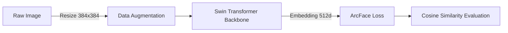

# 프로젝트 및 환경 개요
> 길고양이의 개체 식별을 위해 메트릭 러닝(Metric Learning) 기반의 ReID 파이프라인을 구축하고, 한정된 GPU 자원 내에서 최적의 성능을 달성하기 위한 학습 전략 요약.

- **목적** : 야외 환경의 다양한 노이즈에 강건한 고양이 개체 식별(ReID) 모델 학습
- **데이터셋** : `hello-street-cat` 영상 기반 `CatIndividualImages` 프레임 형태 변환 사용[cite: 1, 2]
- **백본 모델** : `MegaDescriptor-L-384` (`timm` 라이브러리 연동)
- **하드웨어 환경** : 제한적인 VRAM 환경 고려 (Google Colab T 4)[cite: 1, 2]

# 주요 기술 스택 및 데이터 파이프라인

- **야생 동물 특화 라이브러리** : `wildlife-datasets`, `wildlife-tools` 활용하여 ReID 데이터 로더 및 Loss 유틸리티 래핑
- **커스텀 학습 루프** : `BasicTrainer` 상속 후 검증 평가(Eval) 및 배치 단위 스케줄러 업데이트를 위한 `CustomTrainer` 구현

- **데이터 증강(Augmentation) 전략**
	- 야생 환경 노이즈 모사를 위한 강한 증강 적용
    - 기본 증강 : `RandomHorizontalFlip`, `ColorJitter` (밤/낮 조명 대비), `GaussianBlur` (모션 블러), `RandomAffine` (위치 이동)
    - 심화 증강 : `RandomErasing` 도입으로 신체 일부 가려짐(Occlusion) 상태 모사

# 하이퍼파라미터 튜닝 전략

> ArcFace 파라미터 미세 조정 및 OneCycleLR 스케줄러 도입을 통해 모델 수렴 안정성 확보 및 92% 이상의 Top-1 Accuracy 달성.

|**파라미터**|**설정값**|**선정 근거**|
|---|---|---|
|**Loss Function**| `ArcFaceLoss` |타겟 클래스 간 각도 마진을 두어 명확한 임베딩(Embedding) 공간 분리|
|**Margin**| `0.35` |자세 및 조명에 따른 털빛 변화 등 높은 클래스 내 변동성(Intra-class variation)을 고려해 기본값보다 완화|
|**Scale**| `64` |논문 권장 구(Sphere) 반지름 크기 유지|
|**Optimizer**| `AdamW` | `weight_decay=0.05` 상향 조정을 통한 정규화(Regularization) 효과 강화 및 과적합 지연|
|**Scheduler**| `OneCycleLR` |첫 10% 구간 Warmup 도입으로 사전 학습 가중치 파괴 현상 방지 및 안정적 수렴 도모|
|**Max LR**| `0.00005` |Backbone 미세 튜닝(Fine-tuning)에 적합한 학습률 제한|

# 평가 지표 (Metrics)
- **Top-1 Accuracy (Cosine Similarity 기반)**
    - 백본 네트워크 출력(특징 벡터)을 `L2 Normalize` 처리하여 정규화
    - 검증(Validation) 세트 내 특징 벡터 간 쌍(Pairwise) 유사도 행렬 연산
    - 자기 자신 제외(대각선 행렬 -1 처리) 최고 유사도 객체의 라벨이 실제 라벨과 일치하는지 판별

# 트러블슈팅 및 튜닝 가이드
> 메모리 제약 및 성능 정체(Plateau) 구간을 극복하기 위한 대처 가이드라인.

-  **OOM 극복 및 유효 배치(Effective Batch) 사이즈 확보**
	- **이슈** : `L-384` 대형 트랜스포머 모델 로드 시 VRAM 한계 초과 위험
	- **대처** : 물리적 `batch_size` 축소 (예: 4) 및 Gradient Checkpointing 활성화
	- **전략** : `accumulation_steps=8` 설정을 통해 유효 배치 사이즈 `32` 를 안정적으로 유지하며 가중치 업데이트[cite: 2]
- **성능 정체 및 과적합(Overfitting) 발생 시**
    - **이슈** : Train Loss는 지속 하락하나 Validation Accuracy 정체 현상 발생[cite: 1]
    - **대처** : 옵티마이저의 `weight_decay` 수치 상향 조정 및 증강(Augmentation) 난이도 격상
    - **운영** : `Patience=5` 기반 조기 종료(Early Stopping) 롤백 장치 마련[cite: 2]
- **OneCycleLR 도입 시 에러 대응**
    - **이슈** : 배치(Step) 단위 스케줄링 시 누적 계산 오차로 인한 `ValueError` 및 학습 중단
    - **대처** : `total_steps` 산출 시 `math.ceil` 적용. 잔여 배치(Leftover gradients)를 단일 스텝으로 정확하게 계산하여 스케줄러 보폭 일치 필수.