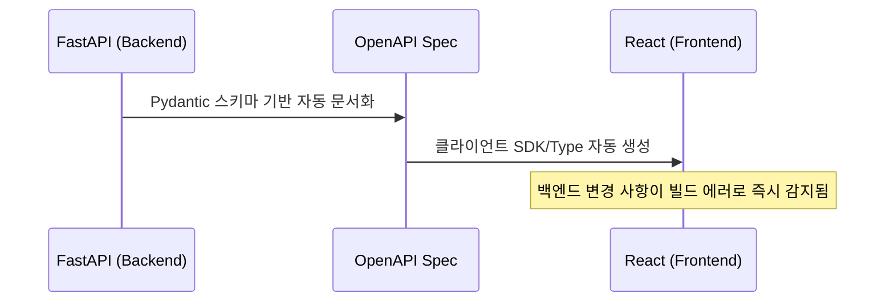

# 아키텍처 설계 전제
> 기획 변경 가능성이 높으므로, 핵심 목표는 **"변경의 영향 범위 국소화(Localize)"**. 한 기능 수정 시 다른 기능이 깨지지 않는 구조 우선.

# FastAPI 백엔드 설계

## 도메인(Feature) 기준 분리 원칙
- **Netflix Dispatch**에서 영감을 받은 구조 .
- `fastapi-best-practices(zhanymkanov)` : github 대표 예시.
- 기술적 파일 타입(routers, models 등) 분류 지양
- **기능(Domain) 단위** 분리 채택 (e.g., `auth`, `detection`, `reid`)
- 요구사항 변경 시 하나의 도메인 폴더 내부만 수정하여 리팩토링 비용 최소화
- 구조 예시
```
src/
├── auth/
│   ├── router.py       # 엔드포인트
│   ├── schemas.py      # 요청/응답 Pydantic 모델
│   ├── models.py       # DB 모델(ORM)
│   ├── service.py      # 비즈니스 로직
│   ├── dependencies.py # 이 도메인 전용 Depends
│   ├── exceptions.py
│   └── constants.py
├── detection/           # 예: 탐지 관련 도메인
│   ├── router.py
│   ├── schemas.py
│   ├── service.py       # ReIdPredictor 호출 등
│   └── ...
├── reid/                 # 예: ReID 매칭 관련 도메인
│   └── ...
├── media/                # 예: 영상/이미지 업로드·스트리밍 관련
│   └── ...
├── core/                # 전역 설정, 보안, 로깅
├── db/                  # DB 세션, 베이스 클래스
└── main.py
```

## 도메인 내부 계층 분리 원칙
- `router.py` : HTTP 요청/응답 제어 전담. 비즈니스 로직 배제.
- `service.py` : 실제 비즈니스 로직(모델 추론, 매칭 등) 구현.
- `schemas.py` : Pydantic 요청/응답 모델. DB 모델(`models.py`)과 엄격히 분리.

# 비동기 및 추론 처리 아키텍처
- **짧은 요청(단일 이미지 추론)** : 이벤트 루프 블로킹 방지를 위해 FastAPI의 `async def` 엔드포인트에서 `run_in_executor` 또는 스레드풀로 GPU 추론 실행.
- **긴 작업(영상 배치 처리)** : `BackgroundTasks` 활용. 부하 증가 시 Celery/RQ 같은 별도 워커 큐로 분리.
	- 진행 상황 조회 API를 별도로 두는 패턴이 일반적
- **실시간 스트리밍** : WebSocket 라우터 분리 (`media/` 또는 `streaming/` 도메인).
- **모델 로딩** : `lifespan` 컨텍스트 매니저로 앱 시작 시 한 번만 로드해 전역에 유지(요청마다 로드하지 않도록) 
	- 이후 `Depends` 로 모델 인스턴스를 각 라우터에 주입

# React 프론트엔드 설계

## Feature 기준 구조 (bulletproof-react 패턴)
- `bulletproof-react(alan 2207)` : 대표 github
- 기술 스택 중심이 아닌 **기능 중심**으로 UI 및 로직 결합
- ESLint(`import/no-restricted-paths`)를 통해 Feature 간 직접 참조 차단 권장
- 예시 구조
```
src/
├── app/               # 라우팅, 전역 프로바이더
├── components/        # 여러 feature에서 공유하는 순수 UI 컴포넌트
├── features/
│   ├── detection/      # 예: 탐지 결과 화면
│   │   ├── api/         # 이 feature 전용 API 호출 훅
│   │   ├── components/  # 이 feature 전용 컴포넌트(BBox 오버레이 등)
│   │   └── hooks/
│   ├── reid-match/      # 예: 매칭 결과 화면
│   └── media-upload/    # 예: 영상 업로드/스트리밍 화면
├── hooks/              # 전역 공유 훅
├── lib/                # 외부 라이브러리 래퍼(axios 인스턴스 등)
└── types/              # 전역 공유 타입
```

## 상태 관리 원칙
- **서버 상태** (추론 결과 등) : `TanStack Query` (React Query) 활용.
	- 캐싱·재요청·로딩상태를 자동 처리해주고, 백엔드 스키마가 바뀌어도 훅 하나만 고치면 됨
- **클라이언트 UI 상태** (모달 창 등) : `useState`, `Zustand` 등 가벼운 도구 사용.
- 서버 상태와 UI 상태 혼합 금지.
	- 서버 상태를 Redux 전역 상태에 억지로 넣지 않기

# FastAPI - React 통합 설계
> OpenAPI 명세 기반 **타입 자동 동기화**. 기획 변경 대응에 가장 핵심적인 요소.

- FastAPI의 Pydantic ↔ OpenAPI ↔ TypeScript 클라이언트 자동 생성
- **장점** : 백엔드 API 응답 구조(필드) 변경 시, 프론트엔드 빌드 시점에 타입 에러로 즉시 인지 가능. "화면 `undefined` 노출 사고" 원천 차단.
- 백엔드에서 필드 하나를 추가/삭제/이름 변경 → 프론트엔드 타입이 자동으로 갱신됨 → 빌드 시점(런타임 아님)에 프론트엔드 코드에서 즉시 타입 에러로 드러남



# 요약 디렉토리 구조

```plaintext
lumipet-reid-web/
├── backend/
│   ├── src/
│   │   ├── media/        # 업로드/스트리밍
│   │   ├── detection/    # 객체 탐지 도메인
│   │   ├── reid/         # ReID 매칭 도메인
│   │   ├── results/      # 결과 저장/조회
│   │   ├── core/         # 전역 설정 및 모델 lifespan
│   │   └── main.py
├── frontend/
│   ├── src/
│   │   ├── features/
│   │   │   ├── video-input/    
│   │   │   ├── detection-view/ 
│   │   │   └── reid-results/   
│   │   └── lib/api-client/     # OpenAPI 기반 자동 생성 클라이언트
└── docker-compose.yml
```

# 학습 자료 및 레퍼런스

| **참고 자료**                             | **성격**                                                                   | **링크**                                                                        |
| ------------------------------------- | ------------------------------------------------------------------------ | ----------------------------------------------------------------------------- |
| `fastapi/full-stack-fastapi-template` | FastAPI + React 통합 레퍼런스 (OpenAPI 클라이언트 자동 생성 포함)                         | [Github 링크](https://github.com/fastapi/full-stack-fastapi-template)           |
| `zhanymkanov/fastapi-best-practices`  | FastAPI 도메인 기준 구조 실무 컨벤션                                                 | [Github 링크](https://github.com/zhanymkanov/fastapi-best-practices)            |
| `alan2207/bulletproof-react`          | React Feature 중심 아키텍처 표준 레퍼런스.문서(`docs/project-structure.md`)만 읽어도 도움이 큼 | [Github 링크](https://github.com/alan2207/bulletproof-react)                    |
| FastAPI - Concurrency                 | 비동기 처리(GPU 추론 블로킹 방지) 원리                                                 | [FastAPI Docs](https://fastapi.tiangolo.com/async/)                           |
| FastAPI 공식 문서 — Bigger Applications   | 공식, 기본기                                                                  | [FastAPI Docs](https://fastapi.tiangolo.com/ko/tutorial/bigger-applications/) |
| TanStack Query 공식 문서                  | 서버 상태 관리(React)                                                          | [TanStackQuery](https://tanstack.com/query/latest)                            |


# 검색 방법 팁

- "FastAPI large application structure", "FastAPI domain driven structure" — 구조 관련 최신 글 검색
- "React feature-based architecture", "React screaming architecture" — 프론트 구조 관련
- "OpenAPI TypeScript client generation" 또는 "openapi-typescript-codegen", "orval" — 자동 클라이언트 생성 도구 비교
- GitHub 검색 시 `stars:>1000 fastapi react template` 형태로 필터링하면 검증된 저장소만 걸러볼 수 있음
- 저장소를 고를 때는 최근 커밋 날짜(활발히 유지보수되는지)와 Issues/PR 논의 내용(실무에서 겪는 문제와 해법)을 함께 보는 것이 문서 자체보다 더 유용한 경우가 많습니다