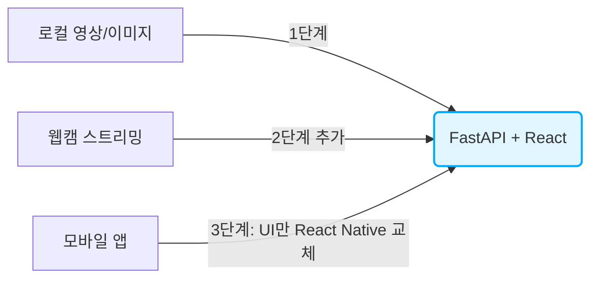

# 전제 조건 정리
> 의사결정에 영향을 주는 프로젝트 제약 사항 및 프레임워크 선택 기준 요약.

- **4대 실질적 채점 기준**
    - Python 모델과의 통합 난이도
    - 스트리밍 확장성
    - API 재사용성 (앱 확장 대비)
    - 1단계 구현 속도

| 항목 | 내용 | 아키텍처 영향 |
|---|---|---|
| 모델 스택 | PyTorch 기반 `ReIdModel`, `wildlife-tools`, ArcFace | Python 프로세스 내 직접 로드 필수 (재구현 지양) |
| 1단계 목표 | 로컬 폴더 영상/이미지 입력 → BBox·매칭 결과 표시 | 실시간성 요구 낮음 (배치/폴링 방식 충분) |
| 2단계 목표 | 웹캠 스트림 입력 → 실시간 추론 → 결과 저장 | 저지연 스트리밍, 카메라 권한(HTTPS), 프레임 관리 필요 |
| 3단계 목표 | 네이티브 앱 제작 가능성 | UI에 종속되지 않는 독립적 API 설계 필수 |

# 백엔드 프레임워크 비교

## FastAPI (권장)
- **장점**
    - ASGI 기반 비동기 : GPU 추론 대기 중 타 요청 처리 가능
    - `WebSocket` 네이티브 지원 : 2단계 스트리밍 확장 용이
    - Pydantic 스키마 기반 **자동 OpenAPI 문서 생성** : API 명세 공유 유리
    - `UploadFile`, `StreamingResponse`, `BackgroundTasks` 등 미디어 및 백그라운드 처리 유용
- **단점**
    - 마이크로 프레임워크 : 인증, ORM 등 직접 구성 필요
    - 비동기-동기 혼합 시 주의 : 블로킹 연산은 `run_in_executor` 등으로 분리 필수
- **적합성** : **최적**. 비동기, WebSocket, 문서 자동화가 2/3단계 요구사항과 완벽히 부합.

## Flask
- **장점**
    - 가장 낮은 학습 곡선
    - 1단계 프로토타입 구현 최속
- **단점**
    - WSGI (동기) 기반 : 실시간 스트리밍/동시 다중 클라이언트 취약
    - 자동 스키마 검증/문서화 부재
- **적합성** : 1단계용으로 매력적이나 2단계 진입 시 재작업 가능성 높음.

## Django (+ DRF)
- **장점**
    - ORM, 관리자 페이지, 인증 기본 제공 (결과 이력 DB화 유리)
- **단점**
    - ML 추론 서버로 사용하기엔 무거움
    - 커스텀 스트리밍 파이프라인 구성 번거로움 (Channels 학습 곡선 가파름)
- **적합성** : 현재 단계에서는 과설계(Over-engineering).

## Node. js 계열 (Express/NestJS)
- **장점**
    - 프론트와 언어 통일(TypeScript)
- **단점**
    - PyTorch 모델 직접 구동 불가
    - Python 추론 서버와 Node 게이트웨이라는 이중 서버 구조 강제 (유지보수 비용 2배)
- **적합성** : 배제. (프론트/백엔드 조직이 완전히 분리된 경우 제외)

## 백엔드 결론

|기준|FastAPI|Flask|Django|Node. js|
|---|---|---|---|---|
|Python 모델 직접 통합|✅ 매우 우수|✅ 우수|✅ 우수(무거움)|❌ 브릿지 필요|
|스트리밍/WebSocket|✅ 네이티브|▲ 확장 필요|▲ Channels 필요|✅ 성숙|
|API 문서화(앱 확장 대비)|✅ 자동|❌ 수동|▲ DRF로 가능|▲ 별도 도구|
|1단계 구현 속도|✅ 빠름|✅ 가장 빠름|❌ 느림|❌ 이중 구조|

# 프론트엔드 프레임워크 비교

## Streamlit / Gradio
- **장점**
    - HTML/CSS/JS 불필요, Python 함수가 곧 UI 콜백
    - 1단계 "로컬 영상 확인용" 목적 달성 **최속**
- **단점**
    - 커스텀 UI/레이아웃 한계 명확
    - 저지연 WebRTC 스트리밍 부적합 (지연 발생)
    - 3단계 앱 확장 시 **코드 재사용 불가** (전체 폐기 필요)
- **적합성** : 1단계 내부 검증용으로만 적합.

## React (+ Vite) (권장)
- **장점**
    - `react-konva`, `fabric.js` 등 성숙한 BBox 오버레이 시각화 라이브러리
    - 2단계 핵심인 웹캠 스트림(`getUserMedia` + `WebSocket` / `WebRTC`) 표준 패턴 보유
    - 3단계 **React Native 전환 시 API 레이어 및 상태관리 로직 재사용 가능**
- **단점**
    - Python 개발자 기준 JS/TS, 상태관리 등 초기 학습 곡선 존재
- **적합성** : 2, 3단계를 고려한 실질적 **최종 목적지**.

## Vue / SvelteKit
- **장점**
    - React 대비 완만한 학습 곡선, 간결한 문법
- **단점**
    - CV/비전 특화 컴포넌트 생태계 부족
    - 네이티브 앱 전환 시 참고 레퍼런스 및 코드 재사용성 저하
- **적합성** : 향후 앱 확장성을 고려할 때 React 대비 우위 없음.

## 프론트엔드 결론

|기준|Streamlit/Gradio|React|Vue/Svelte|Vanilla JS|
|---|---|---|---|---|
|1단계 구현 속도|✅ 최속|▲ 보통|▲ 보통|✅ 빠름|
|BBox/캔버스 커스텀 시각화|❌ 제한적|✅ 우수|▲ 직접 구현 多|▲ 직접 구현|
|웹캠 실시간 스트리밍(2단계)|▲ 제한적|✅ 표준 패턴 존재|✅ 가능|▲ 가능하나 관리 어려움|
|앱 전환 재사용성(3단계)|❌ 없음|✅ 높음(RN)|▲ 낮음|❌ 없음|
|학습 곡선(Python 개발자 기준)|✅ 거의 없음|❌ 있음|▲ 중간|✅ 거의 없음|

# 조합별 종합 평가

| 조합                             | 1단계 속도 | 2·3단계 확장성 | 총평                                                                                                                                                            |
| ------------------------------ | ------ | --------- | ------------------------------------------------------------------------------------------------------------------------------------------------------------- |
| **FastAPI + Streamlit/Gradio** | ★★★★★  | ★☆☆☆☆     | 가장 빠르지만 나중에 프론트를 통째로 버려야 함. "실험용" 목적이 명확할 때만 정당화됨                                                                                                             |
| **FastAPI + React (Vite)**     | ★★★☆☆  | ★★★★★     | 초기 투입 비용이 있지만 재작업 없이 2·3단계로 직행. 장기적으로 총 개발량이 가장 적음                                                                                                            |
| Flask + Streamlit/Gradio       | ★★★★★  | ★☆☆☆☆     | FastAPI 대비 백엔드 이득 없이 단점만 상속. 비권장                                                                                                                              |
| Django + React                 | ★★☆☆☆  | ★★★★☆     | 사용자 관리/DB 이력이 핵심이라면 고려 가능하나 현재 요구사항엔 과함                                                                                                                       |
| FastAPI + HTMX (서버 렌더링)        | ★★★★☆  | ★★☆☆☆     | React보다 가볍게 "서버가 그린 HTML 조각"만 갱신하는 방식. BBox를 서버에서 이미지에 직접 그려 내려주면 프론트 복잡도를 크게 낮출 수 있음. 다만 WebRTC 등 클라이언트 측 미디어 제어가 필요해지는 2단계부터는 결국 JS 코드가 늘어나 React와의 격차가 줄어듦 |

# 권장안 (단계적 접근)
> "전략 A" (처음부터 FastAPI+React) 채택을 강력히 권장.

| 조합                          | 1단계 속도 | 2, 3단계 확장성 | 총평                                          |
| --------------------------- | ------ | ---------- | ------------------------------------------- |
| **FastAPI + React** (전략 A)  | 보통     | **최상**     | 초기 투입 비용 존재하나 2/3단계 직행 가능. **장기적 총 개발량 최소** |
| **FastAPI + Gradio** (전략 B) | **최속** | 하          | 빠른 파이프라인 검증용. 단, 검증 즉시 React로 프론트 전면 교체 필요  |

