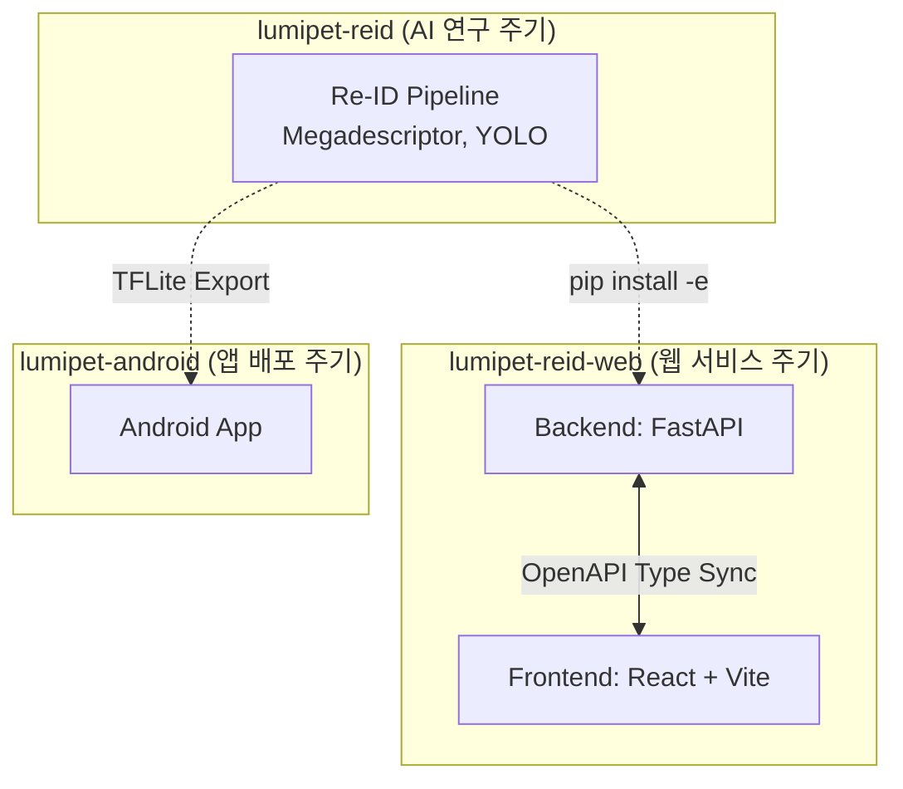

## 저장소(Repository) 운영 전략

> 웹 서비스의 기획 변경에 유연하게 대응하면서도, 무거운 AI 파이프라인 연구가 웹 개발 속도를 저해하지 않도록 웹(풀스택)과 AI (코어) 저장소를 완벽히 분리하여 운영합니다.

- **웹 풀스택 모노레포 (`lumipet-reid-web`)**
    - 프론트엔드(React)와 백엔드(FastAPI)를 하나의 저장소 내 최상위 폴더로 구성
    - **단일 커밋/PR 추적** : API 스키마 변경 시 백엔드와 프론트엔드가 동시에 수정되므로 버전 관리 및 히스토리 파악 용이
    - **자동화 스크립트 공유** : 백엔드의 OpenAPI 명세를 프론트엔드의 TypeScript 타입으로 즉각 동기화 가능
- **AI 코어 독립 저장소 (`lumipet-reid`)**
    - 기존에 작성된 `ReIdPredictor`, `ByteTrack` 등 무거운 파이프라인 코드는 별도 저장소로 유지
    - **릴리스 주기 분리** : 웹 서비스 기획 변경과 무관하게 AI 모델 성능 개선 및 실험(wildlife-tools 연동 등) 진행
    - **모바일 확장성** : 향후 Android 앱(`lumipet-android`)에서 TFLite 모델을 가져갈 때 종속성 꼬임 방지
- **로컬 패키지 연동 방식 (`pip install -e`)**
    - 웹 백엔드 환경에서 AI 코어 저장소를 `pip` 패키지 형태로 가볍게 참조
    - `Submodule` 방식이 유발하는 버전 충돌 문제를 배제하고 파이썬 생태계 표준 방식 채택



## 기술 스택 및 핵심 설계 원칙
> FastAPI 백엔드는 도메인 기능별로 코드를 응집시키고 모델 로딩 병목을 해소하며, React 프론트엔드는 서버 상태와 클라이언트 상태를 철저히 분리하여 설계합니다.

- **Backend (FastAPI)**
    - **도메인(Feature) 중심 디렉토리 설계** : `routers`, `models` 같은 기술적 분류를 지양하고 `detection`, `reid`, `media` 등 기능 단위로 폴더 분리
    - **모델 로딩 최적화** : `Lifespan` 컨텍스트 매니저를 사용하여 FastAPI 앱 가동 시 단 한 번만 VRAM에 AI 모델(BasePredictor) 적재
    - **비동기/논블로킹 처리** : PyTorch/ONNX의 무거운 동기(Sync) 추론 연산이 이벤트 루프를 막지 않도록 `run_in_executor` 스레드풀 또는 `BackgroundTasks` 활용
- **Frontend (React + Vite)**
    - **Feature 기반 컴포넌트 구조** : 백엔드와 동일하게 UI 코드도 도메인 단위로 응집 (`bulletproof-react` 패턴 적용)
    - **상태 관리 분리** :
        - **서버 상태** : `TanStack Query (React Query)` 를 활용하여 영상 로딩 상태, 캐싱, 서버 응답 에러 관리 전담
        - **UI 상태** : 설정 패널 조작, 모달 창 제어 등은 `Zustand` 또는 기본 `useState` 사용
- **BE-FE 브릿지 통신**
    - **OpenAPI 타입 동기화 파이프라인** : `openapi-typescript-codegen` 등 도구를 활용해 Pydantic 모델을 TypeScript 인터페이스로 자동 변환
    - 백엔드 스키마 변경 시 프론트엔드 빌드 에러를 유발하여 런타임 사고(화면 렌더링 실패) 원천 차단

## 전체 디렉토리 트리 프로토타입
> 잦은 기획 변경을 고려하여 처음부터 모든 폴더를 만들지 않고(YAGNI 원칙), 작동하는 최소 단위(MVP) 구성 후 점진적으로 도메인을 확장합니다.

```plaintext
lumipet-reid-web/ (Monorepo Root)
├── README.md
├── docker-compose.yml              # 로컬 테스트용 통합 실행 컨테이너 설정
│
├── backend/                        # FastAPI 백엔드
│   ├── requirements.txt            # (또는 pyproject.toml)
│   └── src/
│       ├── ai/                     # ← AI 실행 전담 계층 (HTTP 개념 없음, 순수 Python)
│       │   ├── engine.py           # 외부 lumipet_reid 패키지의 
│       │   │                       # 모델 로드/싱글턴 관리, GPU 디바이스 배치
│       │   ├── inference.py        # detect(), extract_embedding(), match() 
│       │   │                       # 등 순수 함수형 인터페이스
│       │   └── config.py           # 가중치 경로, threshold 등 AI 전용 설정값
│       ├── main.py                 # Lifespan 모델 로딩 및 라우터 통합
│       ├── core/                   # 앱 전역 설정, lifespan(ai.engine 로드 호출 지점), 로깅
│       ├── media/                  # 도메인 1: 입출력 영상/이미지 파일 관리
│       │   ├── router.py
│       │   ├── service.py
│       │   └── schemas.py
│       │
│       └── reid/                   # 도메인 2: Re-ID 추론 로직
│           ├── router.py
│           ├── service.py          # run_in_executor 비동기 처리, 
│           │                       # ai.inference 호출 + 매칭 임계값 등 "제품 로직" 처리
│           └── schemas.py
│
└── frontend/                       # React + Vite 프론트엔드
    ├── package.json
    ├── openapi.json                # 백엔드에서 추출된 API 명세서
    └── src/
        ├── App.tsx
        ├── api/                    # 자동 생성된 TS 클라이언트 코드
        ├── components/             # 공통 UI 컴포넌트 (버튼, 모달 등)
        └── features/               # 도메인별 컴포넌트 및 로직
            ├── upload/             # 영상 업로드 기능
            └── viewer/             # BBox 오버레이 및 결과 캔버스 렌더링
```