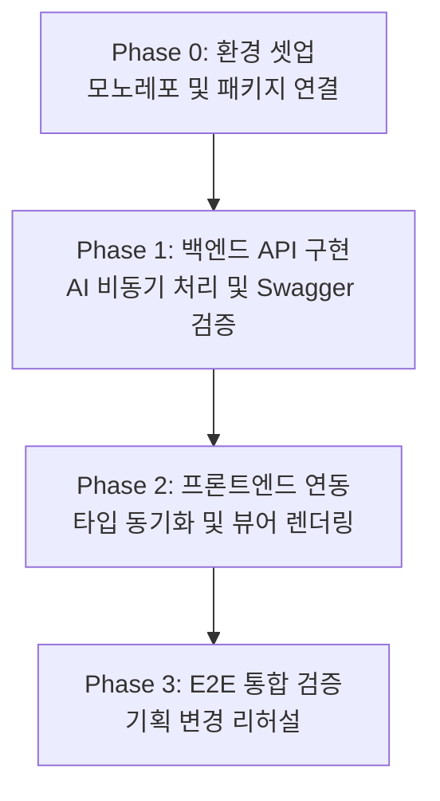

## 전체 개발 워크플로우 개요
> 웹 풀스택 프로젝트의 복잡도를 낮추기 위해 **'작동하는 가장 작은 단위(MVP)'**부터 점진적으로 살을 붙여나가는 단계별(Phase) 애자일 개발 방식을 채택합니다.

## Phase 0. 스캐폴딩 및 AI 코어 연결
> 가장 기초적인 뼈대를 만들고 두 서버(BE/FE)가 독립적으로 구동되는지 확인하는 단계.

- **주요 작업**
    - 모노레포 구조 생성 (`lumipet-reid-web/` 최상위 폴더 하위에 `backend/`, `frontend/` 분리)
    - 백엔드 환경 세팅 (가상환경 생성, FastAPI, uvicorn 설치)
    - **핵심:** 기존 AI 파이프라인 연동. 백엔드 가상환경에서 `pip install -e ../lumipet-reid` 실행하여 외부 코어 저장소 의존성 주입
    - 프론트엔드 스캐폴딩 (`npm create vite@latest` 활용 React + TS 초기화)
- **테스트 및 확인 사항**
    - 백엔드 `main.py` 실행 후 `http://localhost:8000/docs` (Swagger UI) 접속 정상 여부 확인
    - 프론트엔드 `npm run dev` 실행 후 빈 화면 렌더링 정상 여부 확인
    - (주의: 이 단계에서는 BE-FE 간 통신을 구현하지 않음)

## Phase 1. 백엔드 API 구현 및 비동기 처리
> 프론트엔드 없이 FastAPI 백엔드 단독으로 추론 파이프라인을 완성하고 검증하는 단계.

- **주요 작업**
    - `Lifespan` 활용: 앱 시작 시 `ReIdPredictor` 를 한 번만 로드하여 VRAM에 상주
    - `src/ai/` 계층 분리: AI 엔진 실행(engine)과 추론(inference)을 순수 함수형으로 분리하여 HTTP 계층과 격리
    - 추론 라우터(`POST /reid/predict`) 생성: 동기식 AI 연산으로 인한 이벤트 루프 블로킹을 막기 위해 `run_in_executor` 또는 `BackgroundTasks` 적용
    - **응답 스키마 확정:** BBox 좌표, 신뢰도 점수(Confidence), 매칭 결과 등 프론트에 넘겨줄 JSON 스펙 고정
- **테스트 및 확인 사항**
    - Swagger UI에서 로컬 테스트 비디오/이미지를 업로드하여 JSON 결과값 정상 반환 확인
    - 터미널에 `nvidia-smi -l 1` 을 띄워두고, **API 반복 호출 시 GPU VRAM 사용량이 출렁이지 않는지(모델 재로딩 방지) 엄격히 검증**

## Phase 2. 프론트엔드 연동 및 뷰어 렌더링
> 타입 자동화 스크립트를 연결하고 백엔드 데이터를 시각화하는 단계.

- **주요 작업**
    - **타입 동기화 파이프라인 구축:** 백엔드 `openapi.json` 추출 후 TS 클라이언트 코드 자동 생성 스크립트 세팅
    - **상태 관리 통합:** 생성된 API 클라이언트를 `TanStack Query (React Query)` 로 감싸 비디오 업로드, 처리 대기(Loading), 캐싱 로직 구현
    - **뷰어 컴포넌트 구현:** 응답받은 JSON의 BBox 좌표를 기반으로 `<canvas>` 를 활용해 원본 영상 위에 인식 결과(Box + Label) 오버레이
- **테스트 및 확인 사항**
    - React Query Devtools를 화면에 띄워 API 요청 상태(stale, fetching) 변화 눈으로 확인
    - 백엔드를 Mocking 하거나 더미 JSON 데이터를 넣어 캔버스 위 BBox 좌표가 영상 비율에 맞게 정확히 매핑되는지 확인

## Phase 3. E 2 E 통합 검증 및 리허설
> 전체 데이터 파이프라인을 관통 테스트하고, 향후 발생할 기획 변경에 대비하는 훈련 단계.

- **주요 작업**
    - 실제 CatHealth 로컬 영상 데이터를 웹 UI에 업로드하여 최종 시각화 결과 확인
    - 전체 처리 속도, 네트워크 지연(Latency), 오탐 케이스 등 종합 프로파일링
- **기획 변경 대응 리허설 (필수 테스트 과정)**
    1. 백엔드 `schemas.py` 에서 고의로 반환 필드명 변경 (예: `confidence` -> `score`)
    2. 백엔드 재구동 후 프론트엔드에서 **타입 생성 스크립트 실행**
    3. 프론트엔드 `npm run build` 실행 시 **타입스크립트 에러가 즉시 발생하는지 확인** (빌드 타임 에러 캐치 파이프라인 검증 완료)