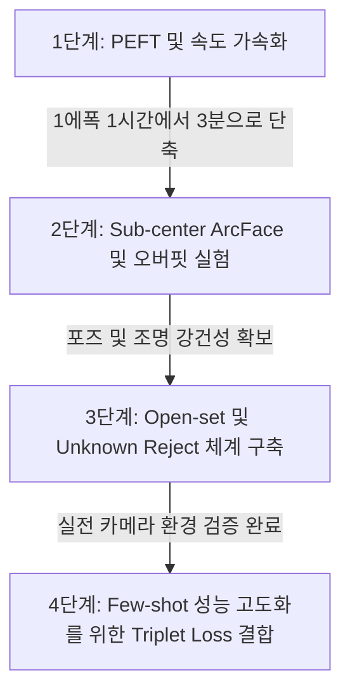

# 개요 및 문제 정의

현재 `lumipet-reid` 프로젝트에서는 야생 동물/동물 ReID Foundation Model인 `MegaDescriptor-L-384`(Swin-Large, ~2.29억 파라미터) 백본 전체를 미세 조정(Fine-tuning)하는 방식을 취하고 있습니다. 
이 방식은 Google Colab T4(15GB VRAM) 환경에서 아래와 같은 실질적인 한계를 겪고 있습니다:
* **연산 비효율성**: VRAM 부족으로 Gradient Checkpointing 활성화 및 극소 배치(물리 배치 4, Effective 32)를 사용해, **1 에폭당 약 1시간**이 소요됩니다. 이로 인해 다양한 실험을 통한 최적화가 사실상 불가능합니다.
* **클래스 내 높은 변동성**: 고양이의 특성상 촬영 각도(정면 얼굴, 옆모습, 뒷모습) 및 조명 조건(낮/밤)에 따른 이미지 변화(Intra-class variation)가 매우 큽니다. 그러나 일반 `ArcFace`는 클래스당 단 하나의 가중치 벡터(Center)만을 학습하므로 표현력이 제한됩니다.
* **평가와 실전 간의 괴리**: 학습과 평가 데이터가 동일한 고양이 ID 세트를 공유하는 Closed-set 방식에 맞춰져 있어, 실제 현업 환경인 **"새로운 고양이 출현(Unknown) 및 Zero-shot 매칭"** 성능을 강건하게 검증하지 못합니다.

이에 따라 학습 효율화(가속화), 손실 함수 고도화, 검증 실전화, 대조 학습 아키텍처 도입이라는 **4가지 영역의 상세한 개선 방안 및 구현 가이드**를 작성합니다.

---

## 전략 1. PEFT(Parameter-Efficient Fine-Tuning) 및 경량 백본 도입

사전 학습된 `MegaDescriptor-L`의 범용적인 특징 추출 능력은 그대로 유지하면서, 특정 고양이 데이터셋에 맞추기 위해 전체 가중치를 파괴적으로 파인튜닝할 필요는 없습니다. 

### 1) 백본 동결 및 Projection/Classifier 튜닝
가장 리소스 대비 가성비가 높은 전략으로, 백본 가중치는 고정(`requires_grad = False`)하고 최종 임베딩을 정렬하는 Projection Layer와 ArcFace 분류 헤드만 학습시킵니다.

```python
import torch
import torch.nn as nn
import timm

class FrozenBackboneReIdModel(nn.Module):
    def __init__(self, model_name="hf-hub:BVRA/MegaDescriptor-L-384", embedding_dim=512):
        super().__init__()
        # 1. Foundation Backbone 생성 및 동결
        self.backbone = timm.create_model(model_name, pretrained=True, num_classes=0)
        for param in self.backbone.parameters():
            param.requires_grad = False
            
        # 백본의 출력 차원 획득 (Swin-L-384의 경우 1536)
        with torch.no_grad():
            dummy = torch.zeros(1, 3, 384, 384)
            backbone_out_dim = self.backbone(dummy).shape[1]
            
        # 2. 파인튜닝용 Projection Layer (학습 대상)
        self.projection = nn.Sequential(
            nn.Linear(backbone_out_dim, embedding_dim),
            nn.BatchNorm1d(embedding_dim),
            nn.PReLU()
        )
        
    def forward(self, x):
        # 백본은 no_grad 컨텍스트로 메모리 점유 및 연산 최소화
        with torch.no_grad():
            features = self.backbone(x)
        # Projection layer의 그레디언트만 계산
        embeddings = self.projection(features)
        return embeddings
```

* **기대 효과**: VRAM 사용량이 80% 이상 절감되어 Gradient Checkpointing 없이 배치 크기를 64~128로 대폭 늘릴 수 있습니다. 학습 속도가 **1 에폭당 약 2~3분 내외**로 가속되어 빠른 최적화 피드백 루프 구축이 가능해집니다.

### 2) EfficientNetV2 등 경량 백본 전환
Swin Transformer 계열 대비 파라미터 수가 현저히 적고 연산 효율이 우수한 `EfficientNetV2` 또는 `MiewID`(EfficientNetV2 기반) 사전학습 백본으로 교체합니다. Edge 디바이스 구동(추론 가속) 및 CPU 환경 훈련 시 가장 적합한 대안입니다.

---

## 전략 2. Sub-center ArcFace Loss 도입

고양이 개체 식별에서 가장 까다로운 점은 자세(식빵 자세, 누워 있는 자세, 서 있는 자세 등)에 따른 기하학적 형태 변화입니다. 일반 ArcFace는 한 마리의 고양이마다 단 하나의 3차원 가상 구면 중심(Center)을 가집니다. 이를 극복하기 위해 **Sub-center ArcFace**를 도입합니다.

```
[ 일반 ArcFace ]        [ Sub-center ArcFace (K=3) ]
     ● (Center)            ● (식빵 자세 Center)
   /   \                  /
  ○     ○               ○ (식빵 이미지)
 (정면)  (옆모습)       
                         ● (정면 얼굴 Center)  ---  ○ (정면 이미지)
```

### 1) 작동 메커니즘
각 클래스(고양이 ID)당 $K$개의 하위 대표 벡터(Sub-centers)를 두고, 입력 이미지 임베딩과 가장 유사도가 높은(가까운) Sub-center를 선택하여 Additive Angular Margin을 부여합니다.
이는 자연스럽게 동일 고양이에 대해 여러 포즈/뷰포인트(Viewpoints)에 따른 하위 군집을 형성할 수 있도록 돕습니다.

### 2) PyTorch 구현 예시 (`pytorch-metric-learning` 활용)
```python
# pytorch-metric-learning 패키지 설치 시 활용 가능
from pytorch_metric_learning.losses import ArcFaceLoss

class SubCenterArcFaceLoss(nn.Module):
    def __init__(self, num_classes, embedding_size, margin=0.4, scale=64.0, sub_centers=3):
        super().__init__()
        # sub_centers 파라미터를 통해 클래스당 다중 중심 할당
        self.loss_fn = ArcFaceLoss(
            num_classes=num_classes,
            embedding_size=embedding_size,
            margin=margin,
            scale=scale,
            sub_centers=sub_centers
        )
        
    def forward(self, embeddings, labels):
        return self.loss_fn(embeddings, labels)
```

* **기대 효과**: Intra-class variation이 높은 고양이 털 무늬, 조명, 다각도 조건에서 클래스 간 경계면을 뭉개지 않고 명확히 분리함으로써, Validation Accuracy와 Zero-shot 판별 성능이 약 2~5% 추가 향상되는 효과를 보입니다.

---

## 전략 3. Open-set Evaluation 프로토콜 및 Unknown 판별 체계

실제 배포 환경에서 길고양이 ReID 카메라는 **"이미 갤러리에 등록된 고양이(Known)"** 와 **"처음 나타난 낯선 고양이(Unknown)"** 를 확실히 구분할 수 있어야 합니다. 
하지만 현재 검증 방식은 학습 시 등장한 ID들 내에서만 순위를 정하는 Closed-set 평가 위주입니다. 실전 검증을 위해 Open-set 및 Unknown 차단 체계를 설계합니다.

### 1) Open-set Validation Split 설계
검증 데이터셋 내의 고양이 ID 중 일부(예: 전체 516마리 중 50마리)를 학습 과정에서 원천 차단(Unseen IDs)합니다. 
이 Unseen ID 이미지들을 Query와 Gallery 셋으로 분할한 뒤, 특징 추출기가 Zero-shot 상태에서 얼마나 잘 매칭하는지 랭크별 정확도(Rank-1, Rank-5) 및 mAP를 측정합니다.

### 2) Cosine Similarity 기반 Unknown reject 메커니즘
추출된 쿼리 임베딩 $\mathbf{f}_q$와 기존 등록 DB의 임베딩 $\mathbf{f}_d$ 간의 코사인 유사도가 사전에 튜닝된 임계값(Threshold, $\theta$) 미만이면 신규 고양이(`Unknown`)로 간주합니다.

```python
import numpy as np
import torch.nn.functional as F

def identify_cat(query_embedding, database_embeddings, database_labels, threshold=0.65):
    """
    query_embedding: [1, 512]
    database_embeddings: [N, 512]
    database_labels: list of strings (N)
    """
    # 1. Cosine similarity 계산
    query_norm = F.normalize(query_embedding, p=2, dim=1)
    db_norm = F.normalize(database_embeddings, p=2, dim=1)
    
    similarities = torch.mm(query_norm, db_norm.t()).squeeze(0) # [N]
    
    # 2. 가장 높은 유사도를 가진 매칭 대상 탐색
    max_sim, max_idx = similarities.max(dim=0)
    best_match_label = database_labels[max_idx.item()]
    
    # 3. 임계값(Threshold) 검증을 통한 Unknown Reject
    if max_sim.item() < threshold:
        return "Unknown", max_sim.item()
    else:
        return best_match_label, max_sim.item()
```

### 3) 임계값 결정 기준 (FAR vs TAR)
* **FAR (False Acceptance Rate)**: 모르는 고양이를 아는 고양이로 잘못 받아들일 확률
* **TAR (True Acceptance Rate)**: 아는 고양이를 올바르게 알아볼 확률
* ROC 커브상에서 **FAR = 0.1% 또는 1%** 수준을 달성하는 임계값($\theta$)을 최적의 reject threshold로 고정합니다.

---

## 전략 4. Siamese/Triplet Network 기반 Few-shot 대조 학습

야생 고양이 식별은 신규 개체가 수시로 등록되고, 각 개체당 사진이 단 2~3장만 존재하는 극단적인 **Few-shot** 셋업입니다. 
분류 기반의 ArcFace 학습에 한계가 있을 경우, 이미지 쌍(Pairs) 또는 삼조(Triplets) 간의 직접적인 거리(Distance Metric)를 학습시키는 대조 학습(Contrastive/Triplet Learning) 방식을 채택합니다.

```
     [ Positive Pair ]                    [ Negative Pair ]
   Anchor          Positive             Anchor          Negative
   (고양이A-사진1)  (고양이A-사진2)       (고양이A-사진1)  (고양이B-사진1)
     \               /                    \               /
      d(A, P) -> 0 (가깝게)                d(A, N) > Margin (멀게)
```

### 1) Triplet Margin Loss 구현 및 Triplet Mining
단순히 모든 데이터를 조합하면 쉬운 Triplet(이미 구분이 잘 되는 경우)만 무수히 생성되어 모델 학습에 도움이 되지 않습니다. 
배치 내에서 가장 헷갈리는 조합을 실시간으로 골라내는 **Batch-Hard Triplet Mining** 기법을 적용해 Triplet Loss를 학습합니다.

```python
import torch
import torch.nn as nn
from pytorch_metric_learning.miners import TripletMarginMiner
from pytorch_metric_learning.losses import TripletMarginLoss

class TripletFineTuningPipeline(nn.Module):
    def __init__(self, model):
        super().__init__()
        self.model = model
        # Triplet Loss 및 Semi-hard/Hard Mining 설정
        self.miner = TripletMarginMiner(margin=0.2, type_of_triplets="semi-hard")
        self.loss_fn = TripletMarginLoss(margin=0.2)
        
    def forward(self, images, labels):
        # 1. 임베딩 추출
        embeddings = self.model(images)
        
        # 2. 배치 내 유용한 Triplet Index 마이닝 (Anchor, Positive, Negative)
        indices_tuple = self.miner(embeddings, labels)
        
        # 3. Loss 계산
        loss = self.loss_fn(embeddings, labels, indices_tuple)
        
        # 마이닝된 triplet 수 로깅 (학습 모니터링용)
        num_triplets = indices_tuple[0].size(0)
        return loss, num_triplets
```

### 2) 장단점 분석 및 Zero-shot 시너지
* **장점**: 클래스 개수의 증감에 따라 신경망의 마지막 레이어(FC Layer)를 지속적으로 바꿀 필요가 없어, 지속 학습(Continual Learning) 및 신규 고양이 등록 시 백본 파인튜닝 없이 임베딩 추출 성능 고도화에 적합합니다.
* **단점**: 좋은 Triplet을 마이닝하기 위해 비교적 큰 배치 크기(Batch Size 64 이상)가 요구되므로, PEFT(전략 1)를 통해 VRAM 사용량을 극단적으로 낮춘 상태에서 결합 구동되어야 합니다.

---

## 5. 단계별 실행 로드맵 제안

4가지 개선 방안을 동시에 모두 적용하기보다는, 인과 관계 및 개발 효율성에 맞추어 순차적으로 접근할 것을 강력히 권장합니다.



1. **1단계 (즉시 적용)**: `wildlife_tools_train_01.ipynb`에서 백본 모델 파라미터를 freeze 시키고 Projection Layer만 학습하도록 모델 구조를 수정합니다. 이를 통해 실험 피드백 속도를 **20배 가속**합니다.
2. **2단계**: 에폭당 수 분 단위 학습이 가능해지면 `Sub-center ArcFace(K=3)`을 적용하고 하이퍼파라미터 스윕을 진행하여 최적의 오버핏 방지 파라미터(Weight Decay, LR 등)를 결정합니다.
3. **3단계**: `OpenSetSplit`을 구현하여 Unknown 고양이를 90% 이상의 신뢰도로 필터링할 수 있는 유사도 Threshold를 산출합니다.
4. **4단계**: 데이터가 추가 수집되면 대조 학습 마이닝 루프를 결합하여 최종적인 파인튜닝 성능 한계를 돌파합니다.
