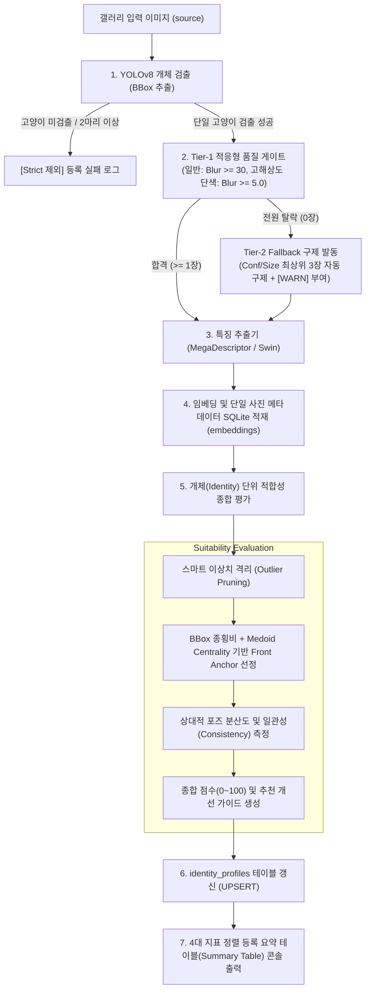
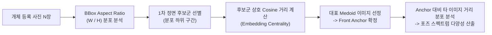
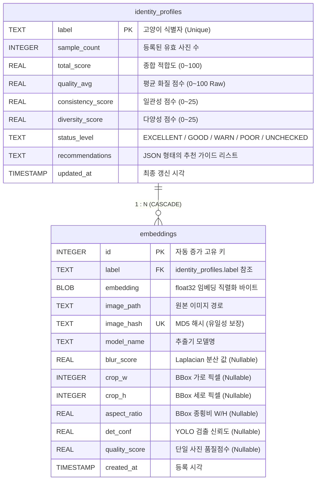

# 갤러리 등록 품질 검증 및 Re-ID 적합성 진단 시스템 설계 명세서

> 고양이 Re-ID 시스템의 등록(`register`) 단계에서 발생하는 오탐(False Positive) 및 단일 시점 편향 문제를 해결하기 위해, 엄격/적응형 품질 게이트, 2단계 Fallback 구제, 스마트 이상치 격리(Outlier Pruning), BBox 종횡비와 임베딩 Medoid를 결합한 포즈 다양성 진단, 100점 만점 적합성 수치화 및 SQLite 기반 프로필 캐싱 아키텍처를 정의함.

---

## 1. 개요 및 배경

### 기존 등록 프로세스의 한계점
- **YOLO 크롭 미적용**: 등록(`register`) 시 원본 전체 이미지를 추출기에 직접 입력하여 배경 잡음 및 다중 개체 노이즈가 임베딩에 혼입
- **품질 필터링 부재**: 실시간 추론(`predict`)에만 `ImageQualityFilter`가 존재하고 등록 시에는 누락되어, 블러(Blur) 및 저해상도 사진이 DB에 적재되어 지속적인 오탐 유발
- **단색 피모(Solid Coat) 오판**: 순백색 고양이 등 단색 개체의 경우 고해상도 초점 사진임에도 피모 내 에지(Laplacian Variance) 부족으로 블러 판정되어 전원 탈락하는 문제 발생
- **오라벨 1장으로 인한 전체 감점**: 다수(3~5장)의 정상 사진 중 단 1장의 이상치(다른 고양이/가림)가 섞여 전체 일관성 점수가 0점으로 폭락하는 현상
- **시점 편향(Single-view Bias)**: 특정 각도(예: 정면만 10장)로 편향 등록될 경우, 실시간 스트리밍 환경에서 측면/후면 개체 매칭 실패율 급증
- **적합성 지표 결여**: 등록된 데이터가 Re-ID에 충분한 품질과 다양성을 갖추었는지 정량적으로 파악할 수 있는 진단 메커니즘 부재

### 설계 목표
- **엄격/적응형 등록 품질 게이트 (Strict & Adaptive Gate)**: 블러, 극소 크롭, 고양이 미검출 이미지를 사전 차단하되, 고해상도 단색 고양이는 적응형 블러 임계치로 유연하게 수용
- **2단계 계층형 Fallback 구제 (Tier-2 Fallback)**: 모든 사진이 탈락(0장)하여 DB에서 개체가 완전히 소실되는 경우, 신뢰도/해상도 최상위 3장을 자동 구제 등록하여 Re-ID 연속성 보장 (`[WARN]` 부여)
- **스마트 이상치 격리 (Outlier Pruning)**: 상호 유사도가 혼자 튀는 이상치(Affinity < 0.40)를 일관성 평가에서 격리하여 정상 개체들의 점수 보존
- **BBox + Medoid 결합형 포즈 다양성 평가**: BBox 종횡비 분포로 1차 후보를 좁히고 개체 내 임베딩 중심성(Centrality)으로 대표 Anchor를 선별하여 상대적 자세 다양성 측정
- **적합성 수치화 (Suitability Score, 0~100점)**: 품질(30), 검출(20), 일관성(25), 다양성(25)을 정량 점수화하고 4대 지표가 정렬된 요약 테이블 및 개선 가이드 피드백 제공
- **SQLite 기반 2계층 캐싱**: 개별 사진 메타데이터와 개체 종합 프로필(`identity_profiles`)을 캐싱하여 $O(1)$ 초고속 조회 및 하위 호환성(`UNCHECKED` 상태 허용) 보장

---

## 2. 전체 등록 및 진단 파이프라인



---

## 3. 세부 기능 및 알고리즘 명세

### 3.1 엄격/적응형 품질 게이트 (Strict & Adaptive Quality Gate - Tier 1)
등록은 1회성 오프라인 작업이므로 기준 미달 사진은 사전 배제하되, 단색 피모 특성을 감안한 적응형 기준을 적용함.

- **검출 기준**: YOLO Confidence $\ge 0.60$, 검출된 고양이 BBox 수 $= 1$ (다중 개체 혼입 차단)
- **해상도 기준**: BBox 가로/세로 최소 $64 \times 64\text{ px}$ 이상 (권장 $256\text{px}$)
- **적응형 선명도 기준 (Adaptive Blur)**:
  - **일반 모색**: Laplacian 분산 $\ge 30.0$ (모션 블러 및 초점 이탈 차단)
  - **고해상도 단색 고양이 ($\ge 512\text{px}$ & $\text{Conf} \ge 0.85$)**: Laplacian 분산 $\ge 5.0$ (흰 고양이 등 텍스처 에지 부족으로 인한 오판 방지)
- **조도 기준**: Grayscale 히스토그램 평균 밝기 $20.0 \sim 240.0$ (극심한 역광/암전 차단)

### 3.2 2단계 계층형 Fallback 구제 파이프라인 (Tier-2 Fallback)
모든 등록 사진이 Tier-1 게이트를 통과하지 못해 **통과 장수가 0장인 경우**, Re-ID 매칭 대상에서 해당 라벨이 완전히 증발하는 문제를 방지하기 위해 2단계 안전장치를 가동함.

- **발동 조건**: $$\text{len}(\text{tier1_passed}) == 0$$
- **구제 로직**: 탈락 후보군 중 $$\text{Confidence} \times \text{Crop Resolution}$$ 점수가 가장 높은 상위 후보를 최대 3장까지 자동 구제하여 등록
- **상태 부여**: 프로필 상태를 `[WARN] (품질 주의/단색 보정 등록)`으로 지정하고 선명한 사진 보완을 권장

### 3.3 스마트 이상치 격리 (Outlier Pruning)
등록 사진 $$N \ge 3$$ 장 중 1장의 오라벨/가림 사진으로 인해 전체가 억울하게 `POOR (Consistency=0)` 판정을 받는 것을 방지함.

- **개별 친화도(Affinity) 산출**:
  $$\text{Affinity}_i = \frac{1}{N-1} \sum_{j \neq i} \cos(e_i, e_j)$$
- **이상치 판정 조건**:
  $$\text{Affinity}_i < 0.40 \quad \text{and} \quad \text{Affinity}_i < (\text{median}(\text{Affinity}) - 0.20)$$
- **격리 조치**: 조건을 만족하는 최대 1~2장의 사진을 일관성 평가에서 제외(`(1 Pruned)`)하고, 정상 클러스터($N-1$ 장)로 일관성 점수를 재산출하여 정상 복구($$S_{consistency} = 25.0$$)함.

### 3.4 BBox + Medoid 결합형 포즈 다양성 평가 메커니즘
Foundation Model 임베딩은 외형, 털 패턴, 포즈, 배경 등이 복합 반영되므로, **개체 내부 데이터 기반 2단계 Anchor-Medoid 파이프라인**을 적용함.



#### Step 1: BBox Aspect Ratio 기반 정면 후보군 추출
- 개별 이미지의 BBox 종횡비 $$R_i = \text{width}_i / \text{height}_i$$ 계산
- 해당 고양이 등록 사진군 내 $$R_i$$ 분포에서 하위 분위(세로 비율이 상대적으로 높은 구간, 상위 40%) 사진들을 1차 정면 후보군 $$C_{front}$$로 선정

#### Step 2: 임베딩 Medoid 기반 Front Anchor 확정
- 후보군 $$C_{front}$$ 내 각 이미지 $$i$$에 대해, 후보군 내 다른 이미지들과의 평균 코사인 거리(Centrality)를 계산:
  $$\text{Centrality}(i) = \frac{1}{|C_{front}| - 1} \sum_{j \in C_{front}, j \neq i} (1 - \cos(e_i, e_j))$$
- $$\text{Centrality}$$ 값이 가장 작은(중심에 가장 가까운) 실제 이미지를 해당 개체의 **`Front Anchor`**로 지정

#### Step 3: 상대적 포즈 다양성(Diversity Spectrum) 평가
- 확정된 `Front Anchor` 벡터 $$e_{anchor}$$ 와 나머지 등록 이미지 벡터 $$e_k$$ 간의 코사인 거리 $$d_k = 1 - \cos(e_{anchor}, e_k)$$ 산출
- $$d_k$$ 의 분포 분산(Variance) 및 범위(Range)를 측정하여, 사진들이 기준 앵커 주변에만 뭉쳐 있는지(단일 뷰) 아니면 적절한 거리차(다각도 뷰)를 두고 고르게 분포하는지 정량화

---

## 4. Re-ID 적합성 수치화 알고리즘 (Scoring Framework)

총 **100점 만점**으로 환산하여 개체별 Re-ID 적합도를 산출함.

$$Score_{total} = S_{quality}(30\text{점}) + S_{detect}(20\text{점}) + S_{consistency}(25\text{점}) + S_{diversity}(25\text{점})$$

| 평가 항목 | 배점 | 세부 산출 로직 | 감점/주의 기준 |
|---|:---:|---|---|
| **1. 이미지 품질 ($S_{quality}$)** | 30 | • Raw 품질 평균($Q_{raw} \in [0, 100]$)의 30점 가중 환산 ($Q_{raw} \times 0.3$)<br>• Laplacian 선명도(40) + 크롭 해상도(30) + 검출 신뢰도(30) | 블러 발생 시 급격 감점 |
| **2. 검출 신뢰도 ($S_{detect}$)** | 20 | • 평균 YOLO Confidence 비례 점수 ($\text{Conf}_{avg} \times 20.0$, 최대 20점) | 신뢰도 저조 시 감점 |
| **3. 개체 일관성 ($S_{consistency}$)** | 25 | • 이상치 격리 후 상호 코사인 유사도 평균 ($S_{intra}$)<br>• $S_{intra} \ge 0.65$ 시 25점 만점 | $S_{intra} < 0.50$ 시 0점 (오라벨링/타 개체 혼입 의심) |
| **4. 포즈 다양성 ($S_{diversity}$)** | 25 | • 등록 유효 장수 ($3 \sim 4$장: 최대 15점)<br>• Anchor 대비 코사인 거리 분산 및 범위 (최대 10점) | 1~2장만 등록 시 대폭 감점, 동일 각도 복제 시 감점 |

### 상태 등급 (Status Level)
- **`EXCELLENT` (85 ~ 100점)**: 다각도 고품질 등록 완료. 실시간 스트리밍 환경에서 최상의 식별 성능 보장
- **`GOOD` (70 ~ 84점)**: 식별 가능한 양호 상태. 소폭의 개선 여지 존재
- **`WARN` (50 ~ 69점)**: 단일 각도 편향, 화질 저하 또는 Fallback 구제 등록. 측면/고화질 사진 추가 권장
- **`POOR` (0 ~ 49점)**: 오라벨링 의심 또는 유효 장수 0장. 재등록 필요
- **`UNCHECKED`**: 적합성 검사가 수행되지 않은 레거시 DB 상태

---

## 5. 데이터베이스 스키마 및 마이그레이션

### 5.1 ERD 및 관계 명세
`identity_profiles` (부모, 1)와 `embeddings` (자식, N)가 `label` 외래키로 연결되며, `ON DELETE CASCADE`를 통해 개체 삭제 시 관련 임베딩이 원자적으로 동시 삭제됨.



### 5.2 SQLite DDL 정의

```sql
-- 1. 개체 종합 프로필 테이블
CREATE TABLE IF NOT EXISTS identity_profiles (
    label TEXT PRIMARY KEY,
    sample_count INTEGER NOT NULL DEFAULT 0,
    total_score REAL DEFAULT 0.0,
    quality_avg REAL DEFAULT 0.0,
    consistency_score REAL DEFAULT 0.0,
    diversity_score REAL DEFAULT 0.0,
    status_level TEXT NOT NULL DEFAULT 'UNCHECKED',
    recommendations TEXT,
    updated_at TIMESTAMP DEFAULT CURRENT_TIMESTAMP
);

-- 2. 개별 임베딩 테이블 (컬럼 확장 및 외래키 적용)
CREATE TABLE IF NOT EXISTS embeddings (
    id INTEGER PRIMARY KEY AUTOINCREMENT,
    label TEXT NOT NULL,
    embedding BLOB NOT NULL,
    image_path TEXT,
    image_hash TEXT UNIQUE,
    model_name TEXT NOT NULL,
    blur_score REAL DEFAULT NULL,
    crop_w INTEGER DEFAULT NULL,
    crop_h INTEGER DEFAULT NULL,
    aspect_ratio REAL DEFAULT NULL,
    det_conf REAL DEFAULT NULL,
    quality_score REAL DEFAULT NULL,
    created_at TIMESTAMP DEFAULT CURRENT_TIMESTAMP,
    FOREIGN KEY (label) REFERENCES identity_profiles(label)
        ON UPDATE CASCADE
        ON DELETE CASCADE
);

CREATE INDEX IF NOT EXISTS idx_embeddings_label ON embeddings(label);
CREATE INDEX IF NOT EXISTS idx_embeddings_hash ON embeddings(image_hash);
```

### 5.3 레거시 DB 하위 호환 및 점진적 마이그레이션 전략
1. **스키마 자동 업그레이드**: `EmbeddingStore.__init__` 호출 시 `PRAGMA table_info`를 검사하여 신규 컬럼 및 `identity_profiles` 테이블을 무중단 `ALTER TABLE`로 자동 생성
2. **`UNCHECKED` 상태 수용**: 메타데이터가 비어있는 기존 DB 레코드는 에러 없이 로드되며, `reid list` 조회 시 `[UNCHECKED]`로 안내
3. **온디맨드 자동 채우기 (Lazy Auto-Fill)**:
   - 신규 사진 등록(`register`) 시 동일 `label`의 기존 비어있는 메타데이터를 원본 경로(`image_path`)로 일괄 계산 및 캐싱
   - 모델 마이그레이션(`reid migrate`) 실행 시, 특징 재추출과 동시에 품질 점수 산출 및 `identity_profiles` 캐싱을 단일 패스(Single-pass)로 완료

---

## 6. 액션 가능한 진단 알림 및 추천 가이드 (Actionable Feedback)

규칙 기반 진단 엔진을 통해 사용자에게 즉각적이고 구체적인 행동 지침을 제공함.

### 피드백 생성 규칙 매핑 테이블

| 조건 (Trigger) | 상태 뱃지 | 출력 메시지 (Recommendation Guide) |
|---|:---:|---|
| $S_{intra} < 0.50$ | `[POOR]` | 🚨 **오라벨링 의심**: 등록된 사진들 간의 생김새 차이가 큽니다. 다른 고양이 사진 혼입 여부를 확인해 주세요. |
| $N_{samples} < 3$ | `[WARN]` | ⚠️ **등록 장수 부족**: 현재 {N}장만 등록되어 있습니다. 최소 3~5장 이상 등록을 권장합니다. |
| $S_{diversity} < 12$ | `[WARN]` | 📸 **시점 편향**: 정면 등 특정 각도 사진 위주로 등록되었습니다. 고양이의 '좌/우 측면 몸통' 사진을 추가해 주세요. |
| $Q_{raw} < 40.0$ | `[WARN]` | 🔍 **선명도 저조**: 일부 사진의 해상도가 낮거나 흔들렸습니다. 선명한 고화질 사진으로 교체해 주세요. |
| $Score_{total} \ge 85$ | `[EXCELLENT]` | ✅ **최적 등록 상태**: 다각도 및 고화질 데이터가 고르게 확보되어 실시간 Re-ID에 최적화되었습니다. |

---

## 7. 컴포넌트 인터페이스 및 CLI 명령어 명세

### 7.1 컴포넌트 설계 (`reid/core/quality.py`)

```python
from dataclasses import dataclass, field
from enum import Enum
from typing import List, Optional, Tuple
import numpy as np

class StatusLevel(str, Enum):
    EXCELLENT = "EXCELLENT"
    GOOD = "GOOD"
    WARN = "WARN"
    POOR = "POOR"
    UNCHECKED = "UNCHECKED"

@dataclass
class QualityMetrics:
    blur_score: float
    crop_w: int
    crop_h: int
    aspect_ratio: float
    det_conf: float
    is_valid: bool
    quality_score: float

@dataclass
class SuitabilityReport:
    label: str
    sample_count: int
    total_score: float
    quality_avg: float               # Raw 평균 (0 ~ 100)
    quality_score_weighted: float    # 가중 반영 배점 (0 ~ 30)
    detect_score: float              # 검출 배점 (0 ~ 20)
    consistency_score: float         # 일관성 배점 (0 ~ 25)
    diversity_score: float           # 다양성 배점 (0 ~ 25)
    status_level: StatusLevel
    recommendations: List[str] = field(default_factory=list)
    front_anchor_idx: Optional[int] = None
    pruned_count: int = 0

class RegistrationQualityInspector:
    """등록 전용 엄격/적응형 품질 검사 및 개체 적합성 진단 엔진"""
    def __init__(
        self,
        min_blur: float = 30.0,
        min_size: int = 64,
        min_conf: float = 0.60,
        adaptive_blur_size: int = 512,
        adaptive_min_blur: float = 5.0
    ) -> None: ...

    def inspect_single_crop(self, crop: np.ndarray, det_conf: float, image_name: str = "") -> QualityMetrics:
        """단일 크롭 이미지의 화질 및 검출 지표 산출 (적응형 블러 포함)"""
        ...

    def evaluate_identity(
        self, embeddings: np.ndarray, aspect_ratios: List[float], qualities: List[QualityMetrics], label: str
    ) -> SuitabilityReport:
        """BBox 종횡비 + Medoid Front Anchor 선정, 이상치 격리 및 종합 적합도 산출"""
        ...
```

### 7.2 CLI 명령어 및 요약 테이블 콘솔 출력 명세

```bash
# 1. 고양이 등록 (엄격/적응형 품질 게이트 및 Tier-2 Fallback 자동 적용)
reid register source=./datasets/cream_heroes
```

**[등록 요약 테이블 출력 예시]**
```text
========================================================================================================================
[Lumipet Re-ID Registration Summary] Total Passed: 25, Rejected: 6 (Fallback Rescued: 3)
------------------------------------------------------------------------------------------------------------------------
Label        Count    Quality(0-30)   Detect(0-20)   Consistency(0-25)   Diversity(0-25)   Total Score   Status
------------------------------------------------------------------------------------------------------------------------
chuchu       6        28.1            17.9           25.0                25.0              96.0          [EXCELLENT]
titi         4        28.3            18.6           25.0 (1 Pruned)     21.2              93.1          [EXCELLENT]
lulu         7        29.3            18.5           25.0                25.0              97.8          [EXCELLENT]
momo         5        29.2            18.3           25.0                25.0              97.5          [EXCELLENT]
white        3        0.0             18.4           25.0                21.2              64.6          [WARN]
========================================================================================================================
```

```bash
# 2. 등록된 개체 목록 및 적합성 상태 조회
reid list

# [출력 예시]
# === Registered Cats Summary ===
#  - chuchu: 6 embedding(s) | 적합도: 96.0점 [EXCELLENT]
#  - titi: 4 embedding(s) | 적합도: 93.1점 [EXCELLENT]
#  - white: 3 embedding(s) | 적합도: 64.6점 [WARN]
#  - legacy_cat: 5 embedding(s) | 적합도: [UNCHECKED] (미검사 상태)
# ===============================

# 3. 특정 개체 정밀 진단 리포트 출력
reid inspect label=titi
```

---

## 8. 기대 효과 및 향후 과제

### 도입 효과
- **오탐(False Positive)의 원천 차단**: 등록 시점의 블러/배경 노이즈/오라벨 유입을 방지하여 매칭 정확도 극대화
- **단색 피모 및 데이터 누락 방지**: Tier-2 Fallback 및 적응형 블러 게이트를 통해 흰 고양이 등 특수 피모 개체의 무결성 및 연속성 확보
- **스마트 이상치 격리**: 1장의 오라벨 혼입으로 인한 전체 라벨 탈락 방지
- **다각도 인식 안정성 확보**: BBox-Medoid 앵커 분석을 통한 측면/다양한 자세 데이터 확보 유도
- **실시간 조회 부하 제로**: 2계층 SQLite 캐싱으로 추론 및 조회 시 딜레이 없는 즉시 응답 제공

### 향후 과제
- **Web API DTO 연동**: FastAPI 백엔드와 React 프론트엔드 간의 `SuitabilityReport` JSON 직렬화 규격 구현 (TODO)
- **동물 포즈 추정기(Animal Pose Estimator) 확장**: 향후 경량 키포인트 모델 연동 시 BBox 종횡비 추정을 고도화된 3D Yaw/Pitch 추정으로 점진적 교체