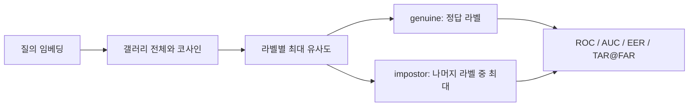

# 들어가며
> Re-ID 시스템을 "좋아졌다"고 말하려면 무엇을 재야 하는가. 이 문서는 고양이 개체 식별 파이프라인에서 실제로 사용한 측정 지표의 정의, 측정 설계(교란 통제 방법), 그리고 5종 모델·2편의 영상·2,250장 크롭으로 얻은 실측값을 정리한 기술 노트. 결론부터 말하면 **코사인 유사도의 절대값은 모델 품질의 지표가 아니며, 그것을 목표로 삼으면 반드시 잘못된 모델을 고르게 됨.**

---

# 왜 원 유사도로는 안 되는가

- Re-ID 시스템의 출력 : 질의 임베딩 `q`와 갤러리 임베딩 `g`의 **코사인 유사도**

$$ s(q, g) = \frac{q \cdot g}{\lVert q \rVert \lVert g \rVert} $$

- 직관적 기대 : "같은 개체면 높고 다른 개체면 낮다" → 높을수록 좋은 모델
- **이 직관이 깨지는 이유** : 임베딩 공간이 좁은 원뿔로 수축하면 **모든 쌍의 유사도가 동시에 상승**
    - 정탐도 오르고 오탐도 오름
    - 절대값은 좋아 보이지만 둘의 **간격**은 오히려 좁아질 수 있음

## ArcFace가 절대값을 보장하지 않는 이유

- ArcFace 손실 : 클래스 중심과의 **각도에 마진 `m`을 더한 뒤** 분류

$$ L = -\log \frac{e^{s \cdot \cos(\theta_{y} + m)}}{e^{s \cdot \cos(\theta_{y} + m)} + \sum_{j \neq y} e^{s \cdot \cos\theta_{j}}} $$

- 최적화 대상 : **각도 마진**(같은 클래스끼리 얼마나 더 가까운가)
- 최적화 대상이 아닌 것 : **절대 각도**(같은 클래스끼리 얼마나 가까운가)
- 결과 : 학습이 진행되면 inter가 0 쪽으로 밀리면서 intra 절대값도 함께 내려갈 수 있음

## 실측 반례

- 등록 이미지 25장(5개체)에 대한 모델별 쌍별 유사도

| 모델 | intra | inter | 전체 평균 | 분리도(intra−inter) | d′ |
|---|---|---|---|---|---|
| pretrained (파인튜닝 없음) | 0.415 | 0.184 | 0.226 | 0.231 | 2.44 |
| **best_weight_ci (과학습)** | **0.776** | **0.363** | **0.439** | 0.413 | **2.20** |
| ci_15 | 0.398 | 0.056 | 0.118 | 0.343 | 2.43 |
| ci_50 | 0.369 | 0.059 | 0.116 | 0.310 | 2.55 |
| ci_hc_15 | 0.366 | 0.055 | 0.112 | 0.311 | **2.76** |

- `best_weight_ci` : intra가 2배로 가장 높지만 **inter도 6배**
- 전체 평균 0.439 = **임의의 두 고양이도 0.44쯤 닮은 공간**
- d′는 오히려 최하위(2.20)
- **유사도가 가장 높은 모델이 판별력은 가장 나쁨**

---

# 지표 정의

## intra / inter / 분리도

- **intra** : 같은 개체 임베딩 쌍의 평균 유사도 (응집도)
- **inter** : 다른 개체 임베딩 쌍의 평균 유사도 (혼동도)
- **분리도(separation)** : `intra − inter`

```python
def identity_separation(emb, other_emb):
    """한 개체의 응집도를 다른 개체와의 거리 대비로 측정."""
    sim = emb @ emb.T
    iu = np.triu_indices(len(emb), k=1)
    intra_mean = float(sim[iu].mean())
    inter_mean = float((emb @ other_emb.T).mean())
    return {"intra_mean": intra_mean,
            "inter_mean": inter_mean,
            "separation": intra_mean - inter_mean}
```

- 절대값 대신 분리도를 쓰는 이유 : **모델이 바뀌어도 기준이 무너지지 않음**
    - ArcFace 학습이 진행되면 intra 절대값이 내려가지만 분리도는 유지되거나 상승

## d′ (d-prime) — 분산까지 반영한 판별력

- 분리도의 약점 : **분포의 퍼짐(분산)을 무시**
    - 평균 차이가 커도 각 분포가 넓게 퍼져 있으면 실제로는 겹침
- d′ : 신호탐지이론(Signal Detection Theory)의 표준 지표

$$ d' = \frac{\mu_{intra} - \mu_{inter}}{\sqrt{(\sigma^{2}_{intra} + \sigma^{2}_{inter}) / 2}} $$

- 의미 : 두 분포 중심 사이 거리를 **공통 표준편차 단위**로 환산
- `best_weight_ci`가 분리도 0.413(1위)인데 d′ 2.20(최하위)인 이유 : 분산이 그만큼 컸음

## genuine / impostor 분포

- **genuine score** : 정답 개체가 등록된 상태에서 정답 라벨과의 최대 유사도
- **impostor score** : 정답이 아닌 개체와의 최대 유사도
- 모든 판정 지표는 이 두 분포의 **겹침 정도**로 환원됨



## ROC · AUC · EER · TAR@FAR

- 임계값 `θ`를 움직이며 두 비율을 추적
    - **TAR**(True Accept Rate, 정탐 수락률) = genuine 중 `s ≥ θ` 비율
    - **FAR**(False Accept Rate, 오수락률) = impostor 중 `s ≥ θ` 비율
- **ROC 곡선** : `θ`를 훑으며 그린 (FAR, TAR) 궤적
- **AUC** : ROC 아래 면적. 임계값과 무관한 순위 품질. 1.0이 완벽, 0.5가 무작위
- **EER**(Equal Error Rate) : `FAR = 1 − TAR`이 되는 지점의 오류율. 낮을수록 좋음
- **TAR@FAR=1%** : "오수락을 100번에 1번으로 억제할 때 정탐을 몇 % 잡는가"
    - 실제 운영 목표에 가장 가까운 지표
    - AUC가 같아도 이 값은 크게 다를 수 있음

```python
def roc(gen, imp):
    y = np.r_[np.ones(len(gen)), np.zeros(len(imp))]
    s = np.r_[gen, imp]
    o = np.argsort(-s); y, s = y[o], s[o]
    tar = np.cumsum(y) / len(gen)
    far = np.cumsum(1 - y) / len(imp)
    auc = float(np.trapezoid(tar, far))
    i = int(np.argmin(np.abs(far - (1 - tar))))
    eer = float((far[i] + 1 - tar[i]) / 2)
    j = max(np.searchsorted(far, 0.01, side="right") - 1, 0)
    return auc, eer, float(tar[j]), float(s[j])   # AUC, EER, TAR@FAR1%, 그때의 임계값
```

## 식별(identification) vs 검증(verification)

- **top-1 정확도** : 등록된 개체 중 1등이 정답인가 → **닫힌 집합** 지표
    - "등록되지 않은 고양이"라는 선택지가 없음
    - 임계값과 무관
- **AUC / EER / TAR@FAR** : "이 고양이가 등록된 개체가 맞는가" → **열린 집합** 지표
    - 임계값이 필요
- 두 지표는 **함께 봐야 함**. top-1이 100%여도 미등록 개체를 전부 수락하면 쓸모없음

## 열린 집합 평가 — leave-one-identity-out

- 문제 : 미등록 개체 영상이 없으면 오수락을 잴 수 없음
- 해법 : **정답 개체를 갤러리에서 제거**하면 그 영상의 모든 프레임이 미등록 개체가 됨

```python
keep = REG_LABELS != gt            # 정답 개체를 갤러리에서 뺀다
sims = query @ reg[keep].T          # 남은 개체와의 유사도
impostor = per_label_max(sims).max(1)   # 이 값이 곧 오수락 점수
```

- 추가 촬영·라벨링 없이 열린 집합 오수락 분포를 얻음

---

# 측정 설계 — 교란을 어떻게 통제했는가

> 지표를 정의하는 것보다 어려운 것은 **비교 가능한 조건을 만드는 것**. 실제 측정에서 세 번의 통제 실험으로 잘못된 결론을 뒤집었음.

## 라벨링 비용 0으로 정답 확보

- 테스트 영상 중 `white_01.mp4`, `lulu_03.mp4`는 **등장 개체가 1마리**
- 파일명이 곧 정답 → 프레임 단위 수동 라벨 불필요
- 등록된 5마리 중
    - 정답 1마리와의 유사도 = **genuine 표본**
    - 나머지 4마리와의 유사도 = **impostor 표본**
- 한 영상에서 정탐·오탐 분포를 동시에 확보

## 크롭 캐싱 — 검출 1회, 모델 N종 공유

- 비교 대상이 5종이면 검출을 5번 돌릴 이유가 없음
- 설계
    1. YOLO 추적을 켠 채 전 프레임 검출, `STRIDE` 간격으로 크롭 저장
    2. 크롭을 **1.25배 패딩**으로 저장 + 원본 박스 좌표를 메타데이터에 기록
    3. 모든 모델·설정이 같은 크롭 파일을 재사용

- 패딩 저장의 이점 : `multi_scale_crop`(0.85 / 1.0 / 1.15) ablation을 **원본 프레임 없이** 재현 가능

```python
def scale_crop(pad, meta, factor):
    """캐싱된 1.25배 패딩 크롭에서 factor 배 크롭을 잘라낸다."""
    x1, y1, x2, y2 = meta["base"]
    px1, py1, px2, py2 = meta["pad"]
    cx, cy = (x1 + x2) / 2, (y1 + y2) / 2
    w, h = (x2 - x1) * factor, (y2 - y1) * factor
    return pad[int(max(py1, cy - h/2)) - py1 : int(min(py2, cy + h/2)) - py1,
               int(max(px1, cx - w/2)) - px1 : int(min(px2, cx + w/2)) - px1]
```

- 규모 : 등록 25장 + 영상 2,250장 = 2,275 크롭 × 5종 모델

## 측정 도구 자체의 검증

- 분석 스크립트는 속도를 위해 FAISS 대신 numpy로 매칭을 재현
- **재현이 맞는지 실제 매처와 대조**

```
k=1: 라벨 일치 400/400   유사도 최대 오차 2.38e-07
k=3: 라벨 일치 400/400   유사도 최대 오차 1.39e-07
k=5: 라벨 일치 400/400   유사도 최대 오차 9.54e-08
```

- 오차는 float32 반올림 수준
- 임베딩 추출도 운영 경로와 동일한 순서 : `BGR → RGB → PIL → Resize(384) → ToTensor → Normalize → fp16 → L2 정규화`

---

# 통제 실험 세 가지

## 실험 1 — 자연 실험과 그 교란

- 관찰 : 등록 사진 출처가 다른 두 개체의 성능 격차

| 영상 | 등록 출처 | genuine | impostor | 마진 | top-1 |
|---|---|---|---|---|---|
| white_01 | **배포 영상과 같은 촬영 환경** | 0.695 | 0.278 | +0.417 | 99.9% |
| lulu_03 | 무관한 사진 | 0.267 | 0.177 | +0.090 | 88.5% |

- 2.6배 격차 → "등록 이미지 도메인이 원인"으로 결론 내고 싶어지는 지점
- **그러나 교란 2개 존재**
    - 개체가 다름 (white vs lulu)
    - 크롭 해상도가 다름 (white 중앙값 412px, lulu 182px)

## 실험 2 — 해상도 통제 (가설 기각)

- 설계 : **내용과 등록 갤러리를 고정한 채 영상 크롭만 축소**
- white_01의 큰 크롭 417개를 목표 크기로 리사이즈 후 재추출

| 목표 크기 | native(412px) | 260px | 200px | 160px | 120px | 90px | 60px |
|---|---|---|---|---|---|---|---|
| genuine | 0.700 | 0.699 | 0.698 | 0.695 | 0.681 | 0.648 | 0.558 |
| 마진 | +0.421 | +0.420 | +0.416 | +0.411 | +0.395 | +0.367 | +0.309 |

- lulu_03의 실제 크롭 크기(182px)는 **완전한 평탄 구간**
- 역방향 실험(등록 크롭을 영상 크기로 축소)에서도 genuine 0.267 → 0.268로 무변화
- **해상도 가설 기각**

> 초기 관찰에서 나온 "해상도-유사도 상관 r=+0.469"는 표본 12개짜리 꼬리에서 발생한 허상이었음. 상관계수만 보고 결론 내렸다면 잘못된 처방을 냈을 지점.

## 실험 3 — 등록 출처 통제 (가설 확인)

- 설계 : 모델·평가 프레임 고정, **등록 출처만 교체**
- 개체 차이 교란 제거 : lulu를 lulu 자신의 영상에서 다시 등록

| 조건 | genuine | 마진 | top-1 |
|---|---|---|---|
| A. 사진 7장 (운영 상태) | 0.267 | +0.090 | 88.5% |
| B. **다른 영상**(lulu_01) 프레임 7장 | 0.309 | +0.132 | 98.0% |
| C. 사진 + 다른 영상 프레임 | 0.320 | +0.144 | 99.1% |
| (참고) **같은 영상** 앞부분 프레임 | 0.519 | +0.340 | 98.5% |

- **top-1과 마진은 크게 개선**(88.5 → 99.1%)
- **절대 유사도는 0.32 수준에 그침**
- 같은 영상을 쓴 0.519는 낙관 편향값 → 배포 기대치가 아님

## 천장은 갤러리가 정한다

- 등록 갤러리 자체의 응집도와 영상 genuine을 나란히 놓으면

| 개체 | 등록 사진끼리 intra | 영상 genuine |
|---|---|---|
| lulu | **0.304** | 0.321 |
| white | 0.516 | 0.703 |

- lulu의 등록 사진 7장은 **서로 0.304밖에 닮지 않음**
- 영상 프레임은 이미 갤러리 응집도만큼 나오고 있음
- **모델이 덜 뽑아내는 것이 아니라, 기준점이 흩어져 있는 것**

---

# 지표가 배포를 예측하지 못하는 문제

> 가장 중요한 발견. 학습 홀드아웃 지표만 보고 모델을 고르면 **배포에서 더 나쁜 모델을 선택하게 됨.**

- 두 학습 run의 지표 대조

| | ci_15 | ci_50 |
|---|---|---|
| lr | 5e-5 | 1e-5 |
| **학습 holdout openset_mAP** | **0.9070** | **0.9039** |
| **실제 영상 lulu_03 AUC** | **0.9916** | **0.8871** |
| 실제 영상 lulu_03 EER | 3.42% | 18.74% |

- 학습 지표 차이 : **0.003** (사실상 동일)
- 배포 지표 차이 : **0.10** (EER 5.5배)
- 원인 : 학습 홀드아웃은 **원본 사진**, 배포는 **영상 YOLO 크롭** → 도메인이 다름

## 모델별 배포 벤치마크 전문

| 모델 | white_01 AUC | white EER | lulu_03 AUC | lulu EER | lulu genuine |
|---|---|---|---|---|---|
| pretrained | 0.9524 | 10.56% | 0.8418 | 26.13% | 0.348 |
| **best_weight_ci** | 0.9973 | 1.95% | **0.6789** | **37.48%** | **0.756** |
| **ci_15** | 0.9835 | 4.31% | **0.9916** | **3.42%** | 0.299 |
| ci_50 | 0.9876 | 2.65% | 0.8871 | 18.74% | 0.267 |
| ci_hc_15 | 0.9888 | 3.30% | 0.9640 | 9.01% | 0.276 |

- **쉬운 케이스(white_01)만 보면 순위가 뒤바뀜** : best_weight_ci가 AUC 0.9973으로 1위
- 어려운 케이스(lulu_03)에서 판별력 붕괴(AUC 0.68) → 유사도만 높고 쓸모없는 모델
- **평가 세트에 어려운 케이스가 없으면 잘못된 모델을 고르게 됨**

## 가중치 변화량으로 학습 강도 추정

- 학습 기록이 없는 체크포인트의 상태를 가중치 자체에서 복원

$$ \delta_{k} = \frac{\lVert W_{k}^{trained} - W_{k}^{pretrained} \rVert_{2}}{\lVert W_{k}^{pretrained} \rVert_{2}} $$

| 가중치 | δ 중앙값 | δ 평균 | δ 최대 |
|---|---|---|---|
| best_weight_ci | **0.0459** | 0.1125 | 0.4858 |
| ci_15 | 0.0137 | 0.0274 | 0.0970 |
| ci_hc_15 | 0.0081 | 0.0189 | 0.0803 |
| ci_50 | 0.0048 | 0.0119 | 0.0606 |

- 파인튜닝 강도와 성능의 관계는 **단조가 아니라 골디락스**
    - 0.0048 (부족) < 0.0137 (최적) < 0.0459 (과함 → 공간 붕괴)
- 메타데이터 없는 구형 체크포인트의 성격을 판정하는 수단으로 유효

---

# 점수 스케일 문제와 정규화

## 전역 임계값이 실패하는 이유

- 최적 조합(ci_15 + 누적 가중평균 + 사진 갤러리)에서의 점수 분포

| 영상 | genuine p1 | p5 | p50 | impostor p95 | p99 | max |
|---|---|---|---|---|---|---|
| white_01 | 0.375 | 0.468 | 0.703 | **0.397** | 0.435 | 0.441 |
| lulu_03 | 0.281 | 0.311 | **0.366** | 0.172 | 0.192 | 0.253 |

- **white_01의 오탐(0.397)이 lulu_03의 정탐 중앙값(0.366)보다 높음**
- 개체별 AUC는 0.9932 / 0.9919로 거의 완벽
- 전역 임계값으로 묶으면 **TAR@FAR1%가 72.8%로 붕괴**

| 전역 임계값 | white TAR / FAR | lulu TAR / FAR |
|---|---|---|
| 0.20 | 100.0% / **97.2%** | 97.5% / 0.9% |
| 0.30 | 99.6% / 68.4% | **67.9%** / 0.0% |
| 0.433 | 96.7% / 1.2% | **0.0%** / 0.0% |

- **어떤 값을 골라도 한쪽이 무너짐** → 분류기의 문제가 아니라 **점수 스케일의 문제**

## 스케일이 달라지는 두 가지 원인

- **갤러리 쪽** : 등록 사진들이 뭉쳐 있으면(white) 어떤 프레임도 그중 하나와 가까움. 흩어져 있으면(lulu) 최근접까지의 거리가 멂
- **질의 쪽** : 흐리거나 작은 크롭은 **모든** 갤러리 항목과의 유사도가 동시에 하락

## 정규화 기법

- 화자·얼굴 인식에서 표준으로 쓰는 세 가지

| 기법 | 정규화 대상 | 수식 |
|---|---|---|
| **T-norm** | 질의 쪽 | `z = (s − μ_cohort(q)) / σ_cohort(q)` |
| **Z-norm** | 갤러리 쪽 | `z = (s − μ_id) / σ_id` |
| **S-norm** | 양쪽 | T-norm과 Z-norm의 평균 |

- T-norm의 장점 : **추가 비용 0**. 매처가 이미 갤러리 전체와의 유사도를 계산하므로 점수 공식만 변경

## T-norm 실측 — 실패

| 점수 방식 | white TAR@FAR1% | lulu TAR@FAR1% | 통합 TAR@FAR1% |
|---|---|---|---|
| **원 유사도 + 개체별 임계값** | **96.6%** | **97.7%** | (72.8%) |
| T-norm z | **4.4%** | 60.7% | 28.7% |
| 여백(top1 − top2) | 90.0% | 89.4% | 70.2% |

- 스케일 정렬 자체는 성공 : genuine p50이 6.371 / 6.415로 거의 일치
- **그런데 판별력을 더 크게 잃음**
- 원인 : 등록 개체 5마리 → **코호트가 4마리**
    - white의 주된 오탐은 titi(둘 다 회색 계열)
    - T-norm은 후보(titi)를 코호트에서 제외 → 남은 3마리는 유사도도 σ도 작음
    - **오탐 z가 폭발** (impostor p95 6.15 vs genuine p50 6.37)
- **결론 : T-norm은 충분히 큰 코호트(수백 개 배경 임베딩)가 전제되는 기법**

## 개체별 임계값 — 채택안

- 전역 상수 대신 개체마다 임계값을 저장
- 등록 시점에는 배포 데이터가 없으므로 **갤러리 통계로 추정**

$$ \theta_{L} = inter_{L} + r \cdot (intra_{L} - inter_{L}) = (1-r)\,inter_{L} + r \cdot intra_{L} $$

- 의미 : impostor 평균과 genuine 평균 사이의 **볼록 결합**. `r`은 어느 쪽에 붙일지의 비율
- 등록 시점 통계와 실측 최적값

| 개체 | n | intra | inter | sep | 실측 최적(FAR1%) |
|---|---|---|---|---|---|
| white | 6 | 0.516 | 0.097 | 0.419 | 0.435 |
| lulu | 7 | 0.304 | 0.050 | 0.254 | 0.192 |
| chuchu | 4 | 0.318 | 0.039 | 0.279 | — |
| momo | 5 | 0.478 | 0.021 | 0.457 | — |
| titi | 3 | 0.370 | 0.067 | 0.302 | — |

- **`r`은 임계값 오차가 아니라 결과 TAR/FAR로 판정**

| 방식 | white TAR / FAR | lulu TAR / FAR |
|---|---|---|
| 실측 최적 (오라클) | 96.6% / 1.0% | 97.7% / 1.1% |
| **r = 0.80 (채택)** | **96.7% / 1.3%** | **89.2% / 0.0%** |
| r = 0.75 | 97.8% / 3.2% | 91.2% / 0.5% |
| r = 0.70 | 98.2% / 7.0% | 93.5% / 0.7% |

- `r=0.8` 선택 근거 : white는 오라클과 사실상 동일 지점, lulu는 보수적으로 치우쳐 **오수락 0%**
- 판단 기준 : **오수락(남의 고양이를 내 고양이로 부름)이 오거부보다 나쁨**
- 한계 : 정답이 있는 개체가 2마리 → **2점 적합**. 설정값으로 노출해 재보정 가능하게 유지

---

# 알고리즘 요인 측정 (ablation)

- 모델과 크롭을 고정하고 스위치만 변경

| 설정 | white_01 AUC | lulu_03 AUC | lulu genuine |
|---|---|---|---|
| 기준 (단일 크롭 / 정렬 없음 / 누적 없음) | 0.9876 | 0.8871 | 0.267 |
| `use_multi_scale_crop=True` | 0.9883 | 0.8852 | 0.269 |
| `use_alignment=True` (영상만) | 0.9823 | **0.8117** | 0.222 |
| `use_alignment=True` (등록도) | 0.9763 | **0.7200** | 0.222 |
| 누적 단순평균 (창 10) | 0.9961 | 0.8963 | 0.279 |
| **누적 가중평균 blur×면적 (창 10)** | 0.9946 | **0.9022** | 0.280 |

- **모멘트 정렬은 명확히 해로움** (AUC 0.887 → 0.720)
- multi-scale은 효과가 오차 범위인데 추출 비용 3배
- 트랙 누적 평균만 일관된 이득 (+0.01 AUC)

## k(투표 수)는 지표에 따라 다르게 작용

- AUC는 라벨별 최대 유사도로 계산 → **k의 영향 없음**
- top-1은 k-NN 투표 결과 → **k의 영향 있음**
- 그리고 **모델에 따라 최적 k가 뒤집힘**

| 설정 | white_01 top-1 | lulu_03 top-1 |
|---|---|---|
| ci_50, k=3 | 99.9% | 88.5% |
| ci_50, **k=5** | 99.9% | **93.3%** |
| ci_15, **k=1** | 99.7% | **99.1%** |
| ci_15, k=5 | 99.6% | 96.4% |

- 갤러리가 개체당 3~7장으로 작음 → k를 키우면 투표에 다른 개체 벡터가 섞임
- **한 모델에서 뽑은 하이퍼파라미터를 다른 모델에 그대로 옮기면 안 됨**

---

# 추적 품질 수치화

- 단일 개체 영상에서 **이상적인 결과는 자명** : 트랙 1개, ID 전환 0회, 최대 트랙 점유율 100%
- 측정 항목
    - **트랙 수** : 부여된 서로 다른 `track_id` 개수
    - **유효 트랙 수** : 검출 5회 이상인 트랙 (한두 프레임짜리 잡음 제외)
    - **ID 전환 횟수** : 연속 프레임에서 대표 트랙이 바뀐 횟수
    - **점유율** : 최대 트랙이 전체 검출 중 차지하는 비율

| 설정 | lulu_03 (트랙·유효·전환·점유) | white_01 (트랙·유효·전환·점유) |
|---|---|---|
| 기존 (N0.25 / B30) | 7 · 7 · 6 · 40% | 7 · 5 · 12 · 92% |
| `new_track_thresh` 0.5 | 5 · 5 · 4 · 40% | 3 · 3 · 2 · 93% |
| **N0.5 + `track_buffer` 90** | 5 · 5 · 5 · 40% | **1 · 1 · 0 · 100%** |
| N0.5 + `match_thresh` 0.85 | 3 · 3 · 2 · 56% | 5 · 5 · 5 · **55%** |

- `new_track_thresh`가 검출 임계값과 같으면(0.25 = `conf`) **약한 검출 하나하나가 새 ID 생성**
- **영상 한 편만 보고 고르면 잘못된 처방** : `match_thresh` 0.85는 lulu_03을 개선하면서 white_01 점유율을 92% → 55%로 붕괴시킴
- 파편화의 비용 : ID가 바뀔 때마다 **누적 임베딩 이력이 폐기** → 누적 평균의 이득 소멸

---

# 파이프라인 프로파일링

- 구간별 시간을 프레임마다 기록하고 CSV로 저장 (`detection / quality_filter / extractor / matcher / rendering`)
- **평균만 보면 병목을 오판** : 구간마다 호출 빈도가 다름

| 구간 | 평균(ms) | 호출된 프레임 비율 | 호출 시 평균(ms) |
|---|---|---|---|
| detection | 15.6~16.0 | **100%** | 15.8 |
| quality_filter | 0.6~0.9 | 59~98% | 0.95 |
| extractor | 0.7~1.6 | **4.6~10.3%** | 15.3 |
| matcher | 0.00 | 4.6~10.3% | 0.04 |

- extractor는 **호출당 15.3ms로 detection과 맞먹지만** 상태 머신 덕분에 5~10% 프레임에서만 실행
- 따라서 전체 기여는 0.7~1.6ms → **캐싱 최적화의 상한이 4%**
- 이 수치가 없으면 "추적 상태 머신이 Lock에 도달하지 못해 FPS 손해"라는 가설에 시간을 쓰게 됨

> 절대 FPS는 GPU 점유 등 환경 요인으로 크게 변동함(같은 영상에서 detection 16.19ms → 4.12ms 관측). 트래커 파라미터 A/B로 원인이 아님을 확인. **절대값보다 구간 비율을 신뢰할 것.**

---

# 데이터 도메인 정량화

- 학습 입력과 배포 입력의 차이를 수치로 환산
- 지표 : **고양이가 원본 프레임에서 차지하는 면적 비율**

$$ ratio = \frac{(x_2 - x_1)(y_2 - y_1)}{W \cdot H} $$

- 학습 데이터 13,021장 전수 측정

| p5 | p25 | p50 | p75 | p95 |
|---|---|---|---|---|
| 15.7% | 32.0% | **46.6%** | 63.1% | 84.8% |

- 배포 입력은 정의상 100% (검출 박스를 그대로 잘라 넣음)
- 선형 배율 차이 = `√(1 / 0.466) ≈ 1.47배`, 하위 5%에서는 `√(1/0.157) ≈ 2.5배`
- 이 값이 사전 크롭 전처리의 **기대 효과 크기를 가늠하는 근거**

> 최초에는 "4000px 원본 사진이니 고양이가 화면 일부만 차지할 것"으로 추정했으나, 실측 중앙값은 46.6%로 이미 상당히 타이트했음. **해상도만 보고 도메인 갭을 추정하면 과대평가하게 됨.**

## 자동 라벨 해소율

- 다중 검출 이미지에서 어느 박스가 정답 개체인지 판정하는 문제
- 방법 : 단일 검출 이미지들로 **개체 프로토타입 임베딩**을 만들고 후보 박스와 비교

```python
proto = normalize(embed(unambiguous_crops).mean(axis=0))
sims = normalize(embed(candidate_crops)) @ proto
chosen = int(np.argmax(sims))
```

| 판정 | 장수 | 비율 |
|---|---|---|
| 단일 검출 | 10,955 | 83.6% |
| **프로토타입으로 해소** | **1,054** | 8.0% |
| 면적 우세로 채택 | 671 | 5.1% |
| 낮은 conf 재시도로 구제 | 151 | 1.2% |
| **크롭 성공** | **12,831** | **97.9%** |
| 수동 처리 필요 | 275 | 2.1% |

- 다중 검출 1,074장 중 **1,054장(98.1%) 자동 해소**
- 남은 275장을 폐기했을 때 학습에서 빠지는 개체 : **509개체 중 1개체**(`0174`)

## 부트스트랩이 성립하지 않는 경우

- `0174`는 20장 **전부** 크롭 실패 → 개체 자체가 학습에서 소멸
- 원인 : 20장 모두 **흰 고양이와 갈색 고양이가 비슷한 크기로 나란히** 등장
    - 면적 우세 규칙 : 두 박스 면적이 비슷해 적용 불가
    - 프로토타입 규칙 : **단일 검출 이미지가 하나도 없어 프로토타입 자체를 만들 수 없음**
- **프로토타입 부트스트랩의 전제** : 개체마다 모호하지 않은 이미지가 최소 1장 존재
- 이런 개체는 폴더명만으로 정답을 알 수 없으므로 원리적으로 수동 판정 대상

> 집계 함수가 이 개체를 놓쳤던 것도 기록해 둘 만함. 성공 건수만 세면 **전량 실패한 개체는 딕셔너리에 키 자체가 없어** 하한 검사를 통과해 버림. 0건 케이스는 별도로 챙겨야 함.

---

# 정리 — 측정에서 얻은 원칙

| 원칙 | 근거가 된 실측 |
|---|---|
| 유사도 절대값은 품질 지표가 아님 | best_weight_ci : genuine 0.756인데 lulu AUC 0.68 |
| 분리도만으로도 부족, 분산까지 봐야 함 | 분리도 1위(0.413)가 d′ 최하위(2.20) |
| 쉬운 케이스만 있는 평가 세트는 순위를 뒤집음 | white_01만 보면 best_weight_ci가 1위 |
| 학습 홀드아웃은 배포를 예측하지 못함 | openset_mAP 차이 0.003 vs 배포 AUC 차이 0.10 |
| 상관계수보다 통제 실험 | 해상도 상관 r=+0.469가 통제 실험에서 기각됨 |
| 하이퍼파라미터는 모델과 함께 이동하지 않음 | 최적 k가 ci_50에서 5, ci_15에서 1 |
| 전역 임계값은 개체별 스케일 차이를 감당 못 함 | white 오탐(0.397) > lulu 정탐 중앙값(0.366) |
| 표준 기법도 전제 조건을 확인해야 함 | T-norm은 코호트 4개에서 TAR 4.4%로 붕괴 |
| 파라미터 튜닝은 여러 조건에서 검증 | `match_thresh` 0.85가 한쪽만 개선하고 다른 쪽 붕괴 |
| 측정 도구 자체도 검증 대상 | numpy 매처 vs FaissMatcher 400/400 일치 확인 |


$\tilde{s}_f \approx \sqrt{2} \cdot \log(C - 1)$
$\tilde{s}_d^{(t)}$
