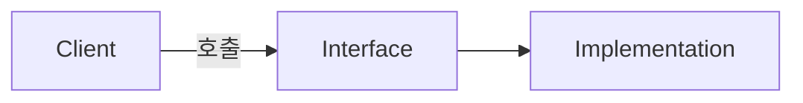

# 블로그 문서 작성 스타일 가이드 (AI 참고용)

> 이 문서는 블로그 포스트(마크다운) 작성 시 지켜야 할 규칙을 정리한 가이드.
> AI가 문서를 생성/편집할 때 아래 규칙을 우선 적용.

---

# 1. 파일명 규칙

- 형식 : `yyyy-mm-dd-Title`
- `Title`은 **PascalCase**
- 예시

```
2025-09-18-AbstractClassAndInterface.md
```

---

# 2. 외부 파일(이미지 등) 경로 규칙

- 형식

```
/assets/images/{category1(소문자)}/{category2(소문자)}/{thumnail 또는 파일제목}/{파일명}
```

- `thumbnail`인 경우 : 경로에 `thumnail` 사용
- 본문 이미지인 경우 : 경로에 해당 문서 파일 제목 사용
- 예시(썸네일)

```
/assets/images/studylog/kotlin/thumnail/kotlin_thumnail_08.png
```

- 예시(본문 이미지)

```
/assets/images/study_log/Kotlin/2025-09-18-AbstractClassAndInterface/image.png
```

---

# 3. 문서 Header (Front Matter)

- 문서 최상단 `---` 사이에 작성
- 필드 목록

| 필드 | 설명 | 비고 |
|---|---|---|
| title | 썸네일에 표시될 제목. `()`에 간단한 카테고리 표기 | - |
| post_order | 문서 정렬 순서 | 1부터 시작 |
| thumbnail | 썸네일 이미지 경로 | 2번 규칙 참고 |
| layout | 문서 형태 | `post` 고정 |
| author | 작성자 | `jhj` 고정 |
| categories | 문서 카테고리 | ex) Project, CatHealth |
| tags | 문서 관련 키워드 | 복수 가능 |
| excerpt | 문서 내용 한줄 요약 | - |

- 예시

```yaml
---
title: (Kotlin) 추상 클래스와 인터페이스
post_order: 8
thumbnail: /assets/images/studylog/kotlin/thumnail/kotlin_thumnail_08.png
layout: post
author: jhj
categories:
  - StudyLog
  - Kotlin
tags:
  - Kotlin
  - AbstractClass
  - Interface
excerpt: abstract class와 interface의 특징
---
```

---

# 4. 제목 규칙

- `#`, `##` 등 사용
- 순서/번호가 중요한 경우가 아니면 숫자 없이 단순 제목만 사용
- 예시

```markdown
# abstract
# 인터페이스
# 다른 내용
```

- (번호가 필요한 경우만 예외)

```markdown
# 1. 설치
# 2. 설정
```

---

# 5. 어미 규칙

- 가능하면 어미 생략 (명사형/개조식 종결)
- 예시

```
X : ~를 실행했습니다.
O : ~를 실행.
```

```
X : 인터페이스는 두 장치를 연결하는 접속기입니다.
O : 인터페이스 : 두 장치를 연결하는 접속기
```

---

# 6. 문장/리스트 작성 규칙

- 문장은 짧게, 개조식으로 작성
- `-` 리스트 사용
- 예시

```markdown
- override 강요
- 선언 필수, 구현 선택
- `override`로 재정의
- 디폴트 정의 가능
    - 디폴트 정의 시 생략 가능
```

---

# 7. 요약(Blockquote) 규칙

- 작성 내용이 길 경우, 제목 하단에 `>` 로 요약 작성
- 이때는 어미 생략하지 않고 줄글 형태로 작성 가능
- 예시

```markdown
# 다른 내용
> 글 요약입니다. 블라블라.
```

---

# 8. 줄바꿈 규칙

- 줄바꿈 적용하는 경우
    - 새로운 제목 시작 전후
    - 코드 블럭 전후
    - 이미지 전후
- 그 외에는 줄바꿈 최대한 자제 (리스트/문단 내부는 붙여서 작성)

---

# 9. 강조 및 시각 자료 규칙

- **강조**(bold) 적극 활용
- `한줄 코드/용어`는 인라인 코드 블럭으로 표기
- 표(table), mermaid diagram 등 시각 자료 최대한 활용
- 예시

```markdown
- 특징
    - 변경에 유연 : 객체 구현이 바뀌어도 코드에 영향 X
    - 낮은 결합도 : 객체의 구조를 몰라도 사용 가능
```



---

# 10. 코드 블럭 규칙

- 언어 명시 (```kotlin, ```python 등)
- 코드 블럭 전후 줄바꿈 필수
- 예시

````markdown
```kotlin
interface Clickable {
    fun click() = println("I was clicked")
}
```
````

---

# 11. 전체 예시 템플릿

```markdown
---
title: (카테고리) 문서 제목
post_order: 순번
thumbnail: /assets/images/{category1}/{category2}/thumnail/{파일명}
layout: post
author: jhj
categories:
  - Category1
  - Category2
tags:
  - Tag1
  - Tag2
excerpt: 한줄 요약
---

# 첫번째 소제목
- 짧은 문장 1
- 짧은 문장 2
    - 하위 항목


```language
코드 예시
```

# 다른 소제목
> 내용이 길 경우 여기에 줄글로 요약 작성.

- 본문 내용
- 본문 내용
```

---

# 12. AI 작성 시 체크리스트

- [ ] 파일명 : `yyyy-mm-dd-PascalCaseTitle` 형식 준수
- [ ] Header 필드 8개 모두 작성 (title, post_order, thumbnail, layout, author, categories, tags, excerpt)
- [ ] 제목에 불필요한 번호 없음
- [ ] 어미 최대한 생략, 개조식 문장
- [ ] 문장 짧게, `-` 리스트 활용
- [ ] 긴 설명은 `>` 요약 블록으로 대체 가능
- [ ] 새 제목/코드블럭/이미지 전후만 줄바꿈
- [ ] **강조**, `인라인 코드`, 표, mermaid 등 시각 자료 활용
- [ ] 이미지/코드 경로 규칙 준수