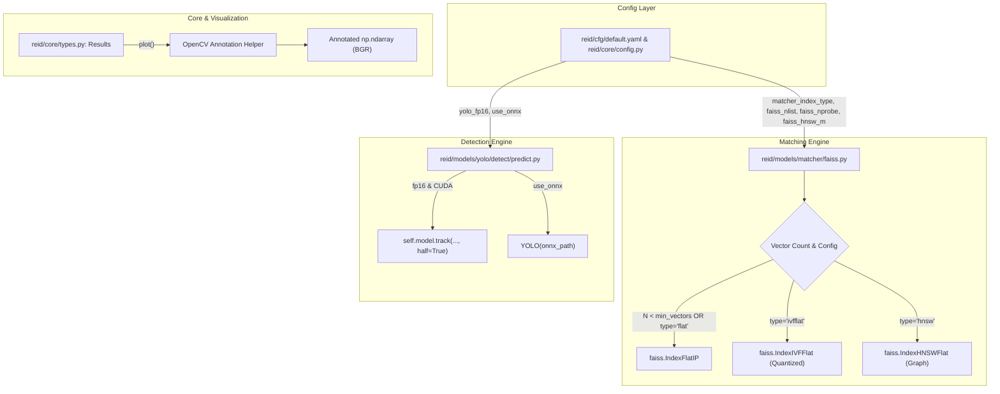

# Design Spec: FAISS CPU Multi-Index Scaling, YOLO FP16/ONNX, and Results.plot() Visualization

- **Date**: 2026-08-12
- **Topic**: CPU FAISS Matcher Index Scaling (`IndexIVFFlat`, `IndexHNSWFlat`), YOLO FP16/ONNX Pipeline Integration, and `Results.plot()` Visualization Completion
- **Target Repository**: `lumipet-reid`

---

## 1. Overview & Objectives

The goal of this enhancement is to improve inference speed, scalability, and usability of the `lumipet-reid` system without introducing breaking changes or breaking existing API contracts.

### Key Objectives
1. **CPU FAISS Scalability**: Replace the single `IndexFlatIP` brute-force matcher with a flexible multi-index strategy on CPU, supporting `IndexFlatIP`, `IndexIVFFlat`, and `IndexHNSWFlat`. Include dynamic fallbacks when vector count is small.
2. **YOLO Pipeline Optimization**: Add explicit support for `half=True` (FP16) half-precision inference and ONNX Runtime model loading in `YoloPredictor` to align detector acceleration with the feature extractor.
3. **`Results.plot()` Completion**: Fully implement the `# TODO` in `Results.plot()` to generate annotated BGR OpenCV numpy image arrays (`np.ndarray`) with customizable options (`show_conf`, `show_similarity`, `line_thickness`, `font_scale`).

---

## 2. Component Architecture & Data Flow



---

## 3. Detailed Component Specifications

### 3.1. FAISS CPU Multi-Index Strategy (`reid/models/matcher/faiss.py`)

#### Configuration Parameters
- `matcher_index_type` (str): Index type to construct (`"flat"`, `"ivfflat"`, `"hnsw"`). Default: `"flat"`.
- `faiss_nlist` (int): Number of Voronoi clusters for `IVFFlat`. Default: `32`.
- `faiss_nprobe` (int): Number of centroids to query for `IVFFlat`. Default: `4`.
- `faiss_hnsw_m` (int): Number of graph links per node for `HNSWFlat`. Default: `32`.
- `faiss_min_ivf_vectors` (int): Minimum vectors needed to build `IVFFlat`. Default: `100`.

#### Index Construction Logic
1. **`IndexFlatIP`**: Direct cosine similarity matrix multiplication. Used when `index_type == "flat"` or when $N < \text{faiss\_min\_ivf\_vectors}$.
2. **`IndexIVFFlat`**:
   - Quantizer: `faiss.IndexFlatIP(d)`.
   - `nlist`: `min(faiss_nlist, max(1, N // 4))`.
   - Training: `index.train(embeddings_f32)` prior to `index.add(embeddings_f32)`.
   - Runtime Search: `index.nprobe = min(faiss_nprobe, index.nlist)`.
3. **`IndexHNSWFlat`**:
   - `faiss.IndexHNSWFlat(d, faiss_hnsw_m, faiss.METRIC_INNER_PRODUCT)`.
   - Directly `index.add(embeddings_f32)`.
4. **Safety & Concurrency**:
   - CPU-only execution using `faiss.omp_set_num_threads()` to match machine CPU thread pool.

### 3.2. YOLO Detector FP16 & ONNX Support (`reid/models/yolo/detect/predict.py`)

1. **FP16 Inference**:
   - In `YoloPredictor.inference()`, check if `getattr(self.cfg, "yolo_fp16", False)` or `getattr(self.cfg, "fp16", False)` is `True` and `device != "cpu"`.
   - Pass `half=True` to `self.model.track(...)` or `self.model(...)`.
2. **ONNX Loading**:
   - In `YoloPredictor.__init__()`, if `getattr(self.cfg, "use_onnx", False)` is enabled and `onnx_detector_path` exists on disk, initialize model with `YOLO(onnx_detector_path)`.

### 3.3. `Results.plot()` Visualization (`reid/core/types.py`)

#### Signature
```python
def plot(
    self,
    show_conf: bool = True,
    show_similarity: bool = True,
    line_thickness: Optional[int] = None,
    font_scale: Optional[float] = None,
    k_colors: Optional[dict] = None
) -> np.ndarray:
```

#### Behavior
1. Check if `self.orig_img` is present. If missing, raise `ValueError("Results object has no orig_img to plot.")`.
2. Create a copy of `orig_img` (`annotated = self.orig_img.copy()`).
3. Compute dynamic `line_thickness` and `font_scale` based on image resolution if not provided.
4. Iterate over `zip(self.boxes, self.match_results)`:
   - For each box, pick color based on `MatchResult.cat_id` (deterministic color hashing per ID) or green for Known, gray for Unknown.
   - Draw filled bounding box corner / outline using `cv2.rectangle`.
   - Construct label text:
     - e.g., `"Nabi | Sim: 0.88"` or `"Nabi | Conf: 0.95, Sim: 0.88"` or `"Unknown"`.
   - Draw background rectangle behind label text for high contrast and draw label text with `cv2.putText`.
5. Return `annotated` as `np.ndarray` (BGR image).

---

## 4. Configuration Updates

### `reid/cfg/default.yaml`
```yaml
# Matcher Index Parameters
matcher_index_type: "flat"  # Options: "flat", "ivfflat", "hnsw"
faiss_nlist: 32
faiss_nprobe: 4
faiss_hnsw_m: 32
faiss_min_ivf_vectors: 100

# Detector FP16
yolo_fp16: False
```

### `reid/core/config.py`
Add dataclass field definitions with default values:
- `matcher_index_type: str = "flat"`
- `faiss_nlist: int = 32`
- `faiss_nprobe: int = 4`
- `faiss_hnsw_m: int = 32`
- `faiss_min_ivf_vectors: int = 100`
- `yolo_fp16: bool = False`

---

## 5. Error Handling & Edge Cases

1. **Empty / Small Embedding DB**:
   - If $N=0$, `FaissMatcher` sets `is_fitted = False` without errors.
   - If $N < \text{faiss\_min\_ivf\_vectors}$, automatically fallback to `IndexFlatIP`.
2. **Missing Original Image in `Results.plot()`**:
   - Raise informative `ValueError`.
3. **No Detections**:
   - `Results.plot()` safely returns an exact copy of `orig_img` with zero drawings.
4. **CUDA Not Available for FP16**:
   - If `device == "cpu"`, gracefully ignore `half=True` to prevent CPU crash.

---

## 6. Testing & Verification Plan

1. **`tests/test_faiss_matcher.py`**:
   - Test `FaissMatcher` fitting with 10 dummy vectors using `"flat"`, `"ivfflat"`, and `"hnsw"`. Verify fallback behavior for small vector counts.
   - Test matching accuracy with 500 dummy vectors for `"ivfflat"` and `"hnsw"`.
2. **`tests/test_results_plot.py`**:
   - Create synthetic `Results` object with dummy image array and 2 BBoxes (`MatchResult(cat_id="Nabi", similarity=0.9, is_known=True)` and `MatchResult(cat_id="Unknown", similarity=0.3, is_known=False)`).
   - Call `results.plot()` and assert returned type is `np.ndarray` with shape equal to input image.
3. **Integration Check**:
   - Run pipeline via `reid/cli.py` or synthetic test loop to verify end-to-end functionality.
