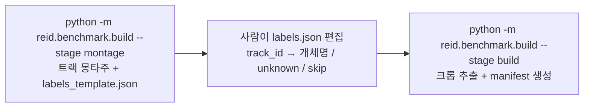
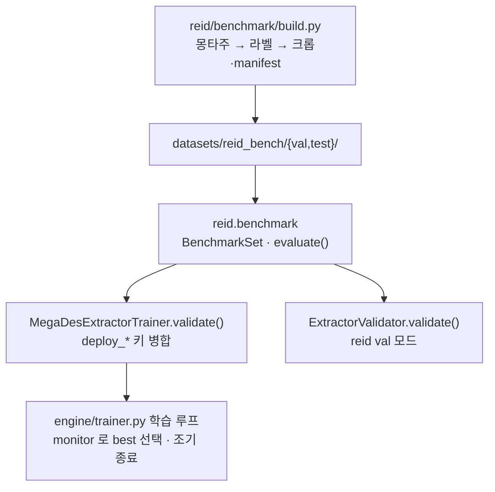
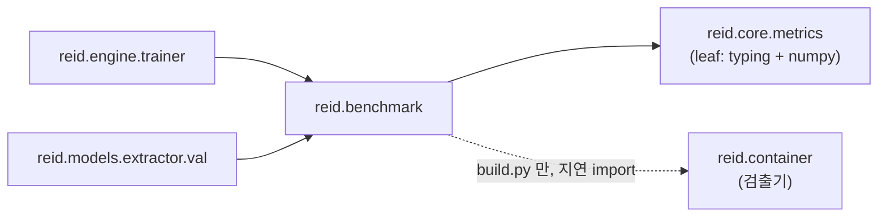

# 배포 도메인 검증 세트 설계 명세

**작성일**: 2026-08-25
**상태**: 승인됨 (2026-08-25)
**구현 계획**: `dev/plans/2026-08-25-deploy-validation-set.md`
**선행 작업**: `dev/notes/2026-08-22-similarity-diagnosis.md` (진단 Spike, 완료)
**브랜치**: `fix/register-detection-mode` (커밋 `7967413`까지 반영됨)

---

## 1. 배경

### 관측된 문제 — 학습 지표가 체크포인트를 잘못 고른다

크롭 데이터 재학습(`results/train/20260823_021559_ci-crop`)에서 `monitor: openset_map`이
epoch 5를 best로 선택했다. 같은 run의 epoch 10(`last.pth`)과 배포 영상에서 비교하면:

| 체크포인트 | openset_map (학습 홀드아웃) | lulu_03 EER | lulu_03 TAR@FAR1% |
|---|---|---|---|
| epoch 5 (**best**로 선택됨) | **95.9%** | 4.68% [3.24–5.95] | 89.9% [85.9–92.8] |
| epoch 10 (last) | 95.4% | **0.90% [0.54–1.80]** | **99.1% [94.1–99.6]** |

부트스트랩 95% 신뢰구간이 겹치지 않는다. **학습 지표가 고른 체크포인트가 배포에서
유의하게 나쁘다.**

같은 실패가 모델 선택 단계에서 이미 한 번 있었다.

| 모델 | openset_map | lulu_03 AUC |
|---|---|---|
| ci_15 | 0.9070 | **0.9916** |
| ci_50 | 0.9039 | 0.8871 |

학습 지표 차이 0.003 vs 배포 지표 차이 0.10. 원인은 도메인 불일치다 — 학습 홀드아웃은
**원본 사진**, 배포는 **영상 YOLO 크롭**이다.

### 왜 지금까지 넘어갔는가

`ExtractorValidator`(현재 `reid val`)도 `dataset_path`의 사진을 동적 분할해 평가한다.
즉 **학습·검증·`val` 모드가 전부 같은 도메인**이라 배포 성능 저하를 감지할 수단이 없었다.

### AUC로는 부족하다 — 지표 선택의 근거

배포 지표라도 아무거나 쓰면 안 된다. 위 두 체크포인트의 AUC는:

| 체크포인트 | lulu_03 AUC | lulu_03 EER | lulu_03 TAR@FAR1% |
|---|---|---|---|
| epoch 5 | 0.9920 | 4.68% | 89.9% |
| epoch 10 | 0.9921 | 0.90% | 99.1% |

**AUC 차이는 0.0001로 두 체크포인트를 구분하지 못한다.** 차이가 저-FAR 구간에 몰려 있는데
AUC는 전 구간을 적분하기 때문이다. 운영 지점이 저-FAR이므로 `monitor`는 저-FAR 민감
지표여야 한다.

---

## 2. 목표와 성공 기준

### 목표

배포 도메인(영상 YOLO 크롭)에서 측정한 지표가 **체크포인트 선택과 조기 종료를 구동**하게 한다.

### 성공 기준

1. `reid train`이 매 epoch 배포 도메인 지표를 산출하고 로그에 남긴다.
2. `monitor: deploy_tar_far1` 설정 시 그 값으로 best 체크포인트가 선택된다.
3. 위 §1의 사례를 재현했을 때 **epoch 10이 best로 선택된다**(현재는 epoch 5).
4. `reid val`이 학습 중 지표와 **정의상 동일한** 값을 산출한다(같은 모듈 사용).
5. 검증 세트가 없는데 `monitor`가 `deploy_*`이면 **학습 시작 시점에 실패**한다.

### 비목표 (이번 범위 밖)

- 모델 성능 개선 자체 — 이 작업은 **자를 만드는 것**이지 자르는 것이 아니다
- `register` 적합도 재보정 (별도 작업)
- 점수 정규화·개체별 임계값 추정식 재보정 (별도 작업)
- 새 영상 촬영

---

## 3. 데이터 설계

### 3.1 val / test 분리

**영상 단위로 분리한다.** 장면이 섞이지 않아 누출이 없고, test가 기존 벤치마크와 동일해
지금까지 측정한 모든 수치와 연속성이 유지된다.

| split    | 영상       | 등장 개체                            | 용도                      |
| -------- | -------- | -------------------------------- | ----------------------- |
| **val**  | lulu_01  | lulu, titi                       | `monitor` 구동 · 체크포인트 선택 |
|          | lulu_02  | lulu, momo, titi(영상 후반)          |                         |
|          | lulu_04  | lulu, **unknown_a**, titi(영상 후반) |                         |
|          | lulu_05  | lulu, momo, **unknown_b**        |                         |
| **test** | white_01 | white 단독                         | 최종 보고 전용. 튜닝에 쓰지 않음     |
|          | lulu_03  | lulu 단독                          |                         |

- val 등록 개체: **lulu, momo, titi** (3마리)
- val 미등록 개체: **unknown_a**(lulu_04), **unknown_b**(lulu_05) — **서로 다른 개체 2마리**
- test 등록 개체: **white, lulu**

### 3.2 미등록 개체를 실제 데이터로 얻는다

지금까지 오수락 표본은 **leave-one-identity-out**(정답 개체를 갤러리에서 빼는 대용법)으로
만들었다. val에는 등록되지 않은 고양이가 실제로 등장하므로 **진짜 오수락 표본**을 쓴다.

- 대용법의 한계: 오수락 점수가 "다른 등록 개체와의 유사도"라 실제 미등록 개체 분포와 다를 수 있음
- 실제 unknown 표본은 이 가정 없이 FAR을 측정한다
- test(단일 개체 영상)에는 unknown이 없으므로 기존 leave-one-out을 유지한다

### 3.3 저장 구조

```text
datasets/reid_bench/
├── val/
│   ├── labels.json          # {video: {track_id: label}}  — 사람이 확정
│   ├── manifest.jsonl       # 크롭 1건당 1줄
│   └── crops/<video>/f######_t###.png
└── test/
    ├── labels.json
    ├── manifest.jsonl
    └── crops/...
```

`val`과 `test`를 **디렉터리로 분리**한다. 같은 디렉터리에 `split` 필드를 두면 실수로
test를 `monitor`에 연결하는 사고가 가능하다.

manifest 한 줄:

```json
{"video": "lulu_02", "frame": 612, "track_id": 14, "label": "lulu",
 "file": "crops/lulu_02/f000612_t014.png",
 "bbox": [120, 88, 305, 260], "conf": 0.91, "weight": 84213.5, "covered": 0.0}
```

- `track_id`, `frame` : 배포와 동일한 **트랙 누적 평균**을 재현하기 위해 필요
- `weight` : `laplacian_variance(crop, imgsz) × 면적`. 크롭 시점에 한 번 계산해 저장한다
  (매 epoch 재계산하면 낭비이고, 값이 모델과 무관하다). **배포는 원본 해상도에서 재므로
  값이 서로 다르다** — 배포 쪽 수정이 핸드오프에 이미 올라 있고, 그때 일치하게 된다
- `covered` : 다른 검출 박스가 이 크롭을 덮은 최대 비율. 한 크롭에 두 마리가 잡힌 경우를
  재스캔 없이 걸러내는 데 쓴다

`datasets/`는 gitignore 대상이므로 자산 자체는 커밋되지 않는다. `labels.json`은 사람의
판정 결과라 재생성이 불가능하므로 **`dev/` 아래에 사본을 둔다**(`dev/reid_bench_labels/`).

### 3.4 라벨링 절차

트랙 단위로 사람이 판정한다. 2단계로 나눈다.



**1단계 산출물**: 트랙마다 **처음·중간·끝 3장**을 나란히 배치한 몽타주.

3장을 쓰는 이유: 트래커가 도중에 다른 개체로 넘어가는 **ID drift**를 눈으로 잡기 위함이다.
1장만 보면 트랙 내부가 섞인 것을 알 수 없고, 그대로 라벨링하면 검증 세트에 오라벨이 들어간다.

**라벨 값**:

| 값 | 의미 |
|---|---|
| 개체명 (`lulu`, `momo`, `titi`) | 등록된 개체 |
| `unknown_a`, `unknown_b`, … | 등록되지 않은 개체. 오수락 표본으로 사용. **개체별로 이름을 구분**한다 |
| `skip` | 판정 불가 또는 ID drift. 검증 세트에서 제외 |

검출 5회 미만인 잡음 트랙은 템플릿에 넣지 않는다.

### 3.5 갤러리 구성

- 운영과 동일하게 **등록 사진에서 즉석 추출**한다 (`datasets/cream_heroes/<label>/*`)
- `embeddings/*.db`를 쓰지 않는 이유: DB 임베딩은 특정 가중치로 뽑힌 값이라 **평가 대상
  모델이 바뀔 때마다 무효**가 된다. `model_name` 컬럼은 가중치 파일을 구분하지 못한다
  (진단 노트 §6)
- 크롭은 커밋 `66685b6` 이후의 **순수 검출 경로**로 만든다 (추적기 경유 없음)
- **검출은 빌드 시점에 1회**만 하고 `datasets/reid_bench/gallery/`에 캐싱한다. 매 epoch
  YOLO를 돌릴 이유가 없다. **임베딩만** 평가 시마다 현재 모델로 다시 계산한다
- 갤러리는 등록된 5마리 전부를 포함한다. val에 없는 개체(chuchu, white)도 **오수락
  후보로는 유효**하기 때문이다

### 3.6 표본 규모

- 영상당 `STRIDE` 간격으로 크롭 저장
    - **val: `STRIDE=6`** (30fps 기준 5Hz) — 매 epoch 돌므로 비용을 억제
    - **test: `STRIDE=3`** — 기존 진단 캐시와 같은 간격이라 지금까지의 수치와 직접 비교 가능
- 추정: lulu_01/02/04/05 합계 약 8,400 프레임 → **약 1,400 크롭**
- 갤러리 25장 + val 1,400장 = 약 1,425회 추출/epoch ≈ **25초** (현재 epoch 340초의 7%)

---

## 4. 지표 설계

### 4.1 개체별로 계산하고 평균한다

운영은 **개체별 임계값**으로 수락을 판정한다(커밋 `e0aed17`). 지표도 같은 구조로 만든다.

등록 개체 `L`에 대해:

- **genuine**: 라벨이 `L`인 크롭. 점수 `s_L(q) = max cos(q, g)` for `g ∈ gallery[L]`
- **impostor**: 라벨이 `L`이 아닌 크롭 (다른 등록 개체 + `unknown_*`). 같은 식으로 `s_L(q)`
- 임계값 `θ_L` = impostor 분포의 `(1−α)` 분위수 (α = `deploy_val_far`, 기본 0.01)
- `TAR_L@FAR=α` = genuine 중 `s_L ≥ θ_L`인 비율

$$ \texttt{deploy\_tar\_far1} = \frac{1}{|\mathcal{L}|}\sum_{L \in \mathcal{L}} TAR_L@FAR{=}\alpha $$

`𝓛` = 해당 split에 genuine 표본이 충분한 등록 개체 집합.

**impostor 는 라벨이 `L`이 아닌 모든 질의**(다른 등록 개체 + `unknown_*`)를 `gallery[L]`로
채점한 값이다.

> **2026-08-26 개정.** 초안에서는 단일 개체 split 을 위해 leave-one-out(갤러리에서 `L`을 빼고
> 채점) 분기를 뒀으나 **제거했다.** genuine 은 `gallery[L]` 척도인데 impostor 는 다른 갤러리
> 척도가 되어 두 값을 같은 임계값으로 비교할 수 없었다. 개체마다 점수 척도가 다르다는 것이
> 애초에 개체별 임계값을 도입한 이유(§8, 커밋 `e0aed17`)인데 그 전제를 스스로 어긴 셈이다.
>
> 그 결과 **오탐 표본이 없는 개체는 평가에서 제외**된다. 질의가 한 개체뿐인 split 은
> 임계값을 정의할 수 없으므로 에러로 멈춘다. 실제 test split 은 영상이 여러 편이라
> 교차 개체 오탐이 존재해 문제가 없다.

### 4.2 산출 지표

| 키 | 정의 | 용도 |
|---|---|---|
| **`deploy_tar_far1`** | 개체별 TAR@FAR1%의 평균 | **`monitor` 권장값** (기본값은 §6 참조) |
| `deploy_eer` | 개체별 EER의 평균 | 로그·보조 |
| `deploy_auc` | 개체별 AUC의 평균 | 로그 전용. **monitor로 쓰지 않는다** (§1) |
| `deploy_genuine` | 개체별 genuine 평균 점수의 평균 | 유사도 절대값 추이 관찰 |
| `deploy_n_ids` | 평가에 포함된 등록 개체 수 | 표본 건전성 확인 |
| `deploy_*_ci` | 95% 신뢰구간 `[하한, 상한]` | **점추정과 항상 함께 본다** |

### 4.5 신뢰구간 — 트랙 단위 층화 부트스트랩

지표를 점추정만 보고하면 잡음을 개선으로 오독한다. 실제로 그런 일이 있었다.

- **트랙 단위로 재표본한다.** 한 트랙 안의 프레임은 같은 장면·조명·자세라 독립이 아니다.
  프레임을 개별 재표본하면 구간이 3배 좁게 나온다(test 기준 [+2.6, +4.6] vs [−3.6, +8.7]).
  실효 표본은 크롭이 아니라 **트랙**이다.
- **개체별로 층화한다.** 평평하게 재표본하면 트랙이 적은 개체가 draw 에서 통째로 빠진다 —
  test 의 `white` 는 트랙이 2개뿐이라 200회 중 28회에서 사라졌고, 그만큼 구간이 부풀었다.
  개체 집합은 점추정과 동일하게 고정한다.

개체별 세부값은 run 디렉터리에 `deploy_val.json`으로 저장한다.

### 4.3 누적 평균 반영

배포는 트랙 단위 누적 가중평균(창 10)을 쓰므로 검증도 동일하게 맞춘다.

```python
# 트랙별 시간순, 최근 WINDOW개의 blur×면적 가중평균 후 L2 정규화
h = track_indices[max(0, n + 1 - WINDOW): n + 1]
mean = (emb[h] * weight[h][:, None]).sum(0) / weight[h].sum()
query = mean / norm(mean)
```

가중치는 manifest의 `weight`를 그대로 쓴다(모델 무관, 크롭 시점 1회 계산).

### 4.4 표본 부족 처리

- 개체 `L`의 genuine 표본이 `deploy_val_min_samples`(기본 30) 미만이면 **평균에서 제외하고
  로그에 경고**한다. titi는 영상 후반에만 등장해 표본이 적을 수 있다
- 등록 개체가 하나도 남지 않으면 **에러**로 처리한다(조용한 폴백 금지)

---

## 5. 아키텍처

### 5.1 배치 결정 — `reid/benchmark/` 서브패키지

벤치마크 기능은 **`reid` 패키지 안의 독립 서브패키지**로 만든다. `reid/core/`에 파일 하나로
넣지 않고, 최상위 `benchmark/`로도 빼지 않는다.

**`reid/core/`에 넣지 않는 이유 (SRP)**

`reid/core/`는 이미 config·types·metrics·quality·tracker·filters·preprocess가 한데 있는
잡화점이다. 벤치마크는 도메인 로직이 아니라 **평가 하네스**라는 별개 관심사이고,
로딩·평가 프로토콜·빌더 세 책임을 파일 하나에 몰아넣으면 `engine/trainer.py`(455줄,
핸드오프의 기존 지적)와 같은 길을 간다.

**최상위 `benchmark/`로 빼지 않는 이유 1 — 배포판에서 조용히 빠진다**

```toml
[tool.setuptools.packages.find]
where = ["."]
include = ["reid*"]
```

최상위 `benchmark/`는 이 필터에 걸려 설치본에 포함되지 않는다. 개발 트리에서는 정상
동작하다가 `pip install .` 한 환경에서 `reid val`이 ImportError로 죽는다.

이 저장소는 **조용히 다르게 동작하는 구조**에 이미 두 번 데었다.

| 사례 | 증상 |
|---|---|
| `_load_model`이 가중치 파일 부재를 무시 | ci_50이 사전학습부터 학습된 줄 모르고 lr 차이로 오해 (진단 노트 A7) |
| `identities_below_minimum`이 전량 실패 개체를 누락 | 개체 `0174` 소멸을 "손실 0"으로 보고 |

같은 유형의 함정을 새로 만들지 않는다.

**최상위 `benchmark/`로 빼지 않는 이유 2 — 패키지 순환**

벤치마크는 ROC·`threshold_at_far` 등 `reid.core.metrics`의 함수를 써야 한다. 최상위에 두면
`reid.engine.trainer → benchmark → reid.core.metrics`로 **패키지 수준 순환**(reid ↔ benchmark)이
생긴다. 순환을 피하려고 지표 로직을 벤치마크에 복제하면 §5.5의 핵심 보장 —
*학습 중 지표와 `reid val`이 정의상 동일* — 이 깨진다. 정의가 두 곳에 있으면 갈라진다.

서브패키지면 같은 배포 단위 안의 계층화라 순환이 아니다. `reid/core/metrics.py`는 의존이
`typing`과 `numpy`뿐인 **순수 leaf**여서 공유 수학 계층으로 적합하다.

### 5.2 모듈 구성

전체 흐름:



파일 구성:

```text
reid/benchmark/
├── __init__.py     공개 API (BenchmarkSet, evaluate)
├── dataset.py      manifest 로딩 · 트랙 그룹핑 · 누적 가중평균
├── protocol.py     genuine/impostor 구성 · 지표 집계
└── build.py        몽타주 → 라벨 → 크롭·manifest 생성
```

| 모듈 | 책임 | 의존 |
|---|---|---|
| `dataset.BenchmarkSet.load(path)` | manifest·라벨 로딩, `skip` 제외, 트랙 그룹핑, 크롭 경로 목록 | `json`, `pathlib`, `numpy` |
| `dataset.BenchmarkSet.accumulate(emb)` | 트랙 경계를 넘지 않는 누적 가중평균 + L2 정규화 | `numpy` |
| `protocol.evaluate(bench, query_emb, gallery_emb, gallery_labels, far, min_samples)` | 개체별 genuine/impostor 구성, split별 impostor 방식 선택, 지표 집계 | `numpy`, `reid.core.metrics` |
| `build.main()` | 트랙 몽타주 생성 → 라벨 적용 → 크롭·manifest 기록 | `cv2`, `reid.core.filters`, **지연** `reid.container` |

**의존 방향은 단방향이다.**



`reid.benchmark`는 `reid.engine`과 `reid.models`를 알지 못한다. 검출기가 필요한 것은
`build.py`뿐이므로 **함수 내부 지연 import**로 처리한다(저장소가 이미 곳곳에서 쓰는 패턴).
평가 경로는 YOLO를 로드하지 않는다.

**임베딩 추출은 호출자가 주입한다 (DIP).**

```python
def evaluate(bench, embed_fn, gallery_fn, *, far=0.01, min_samples=30) -> dict:
    ...
```

- 트레이너 : 학습 중인 모델을 주입
- `reid val` : 로드한 추출기를 주입
- 단위 테스트 : 합성 임베딩을 돌려주는 함수를 주입 → **모델 없이 지표 로직 전체를 검증**

### 5.3 빌더 실행 방식

빌더는 패키지 모듈이므로 `python -m`으로 실행한다.

```bash
python -m reid.benchmark.build --stage montage --split val --out datasets/reid_bench/val
# 사람이 labels.json 편집
python -m reid.benchmark.build --stage build   --split val --out datasets/reid_bench/val
```

`reid <mode>` CLI에 `bench` 모드를 추가하지 않는 이유: `reid` CLI는 `key=value` 규약이고
빌더는 `--stage` 같은 단계 인자가 필요해 규약이 섞인다. 빌더는 **오프라인 1회성 도구**이므로
CLI 표면을 넓히지 않는다.

`baselines/training/`에 두지 않는 이유: `baselines/`는 패키지가 아니라 테스트에서
`importlib.util.spec_from_file_location` + `sys.modules` 수동 등록이 필요하다
(`tests/test_crop_dataset.py`에서 실제로 겪었고, 등록을 빠뜨리자 `@dataclass`가
`AttributeError`로 실패했다). 빌더는 일회성 데이터 준비 스크립트인 `crop_dataset.py`와 달리
**평가 시스템의 일부**이므로 패키지 안에 둔다.

### 5.4 트레이너 연결

**트레이너 루프는 수정하지 않는다.** `engine/trainer.py`는 이미
`metrics = dict(result) ... metric = metrics.get(monitor, -inf)` 구조라, `validate()`가
반환하는 dict에 키를 추가하면 `monitor`가 그대로 작동한다.

`MegaDesExtractorTrainer.validate()` 끝에 병합:

```python
if self.bench is not None:
    result.update(self._benchmark_metrics())   # deploy_* 키
```

- `deploy_val_path`가 비어 있으면 `self.bench = None` → 기존 동작 그대로
- **`monitor`가 `deploy_`로 시작하는데 벤치마크가 없으면 학습 시작 시점에 즉시 에러**

조용한 폴백을 금지하는 이유는 §5.1의 표와 같다.

### 5.5 `reid val` 모드 교체

현재 `ExtractorValidator.validate()`는 `dataset_path` 사진을 동적 분할해 정확도·지연을 잰다.
이 방식은 §1의 도메인 불일치 문제를 그대로 안고 있어 유지 가치가 없다.

- **교체**: 배포 벤치마크 평가로 대체. 기본 대상은 `test` split
- `reid val split=val`로 val split도 평가 가능
- **지연 측정은 제거**한다 — `PipelineProfiler`가 구간별로 더 정밀하게 같은 일을 한다
- 학습 중 지표와 **같은 모듈**을 쓰므로 정의가 어긋날 수 없다
- `BaseValidator`의 `validate(pipeline) -> dict` 계약은 유지한다 (LSP)

---

## 6. 설정 인터페이스

`reid/cfg/default.yaml`과 `Config` 양쪽에 추가한다.

| 키 | 기본값 | 설명 |
|---|---|---|
| `deploy_val_path` | `""` | 검증 세트 경로. 비어 있으면 배포 지표를 계산하지 않음 |
| `deploy_test_path` | `""` | `reid val`의 기본 평가 대상 |
| `deploy_val_far` | `0.01` | 임계값을 잡는 목표 FAR |
| `deploy_val_min_samples` | `30` | 개체별 genuine 최소 표본. 미만이면 평균에서 제외 |
| `deploy_val_window` | `10` | 트랙 누적 평균 창 크기 |
| `deploy_val_max_covered` | `0.25` | 다른 개체가 이 비율 넘게 덮은 크롭은 제외 |
| `deploy_val_bootstrap` | `200` | 층화 부트스트랩 반복 수. 0 이면 구간 생략 |

`monitor` 에는 **값이 클수록 좋은 지표만** 쓸 수 있다. 학습 루프가 `metric > best_metric` 으로
체크포인트를 고르므로(`engine/trainer.py`) `deploy_eer` 를 넣으면 EER 을 최대화해 가장 나쁜
체크포인트를 저장한다. 시작 시점에 거부한다.

`monitor` 기본값은 **`openset_map` 그대로 둔다.** 검증 세트를 갖춘 사용자가 명시적으로
`monitor: deploy_tar_far1`로 바꾸게 한다 — 기본값을 바꾸면 검증 세트 없는 환경에서 §5.4의
에러가 터진다.

---

## 7. 테스트 전략

`dev/workflow.md` §4의 학습 코드 TDD 예외를 적용한다.

### TDD 적용 (CPU에서 수초 내)

| 대상 | 검증 내용 |
|---|---|
| `dataset.BenchmarkSet.load` | manifest 파싱, `skip` 라벨 제외, 트랙 그룹핑, 라벨 매핑 |
| `accumulate` | 트랙 경계를 넘지 않는가, 창 크기 준수, 가중치 반영, L2 정규화 |
| `evaluate` — 정상 | 합성 임베딩으로 TAR/EER/AUC 기댓값 일치 |
| `evaluate` — unknown | `unknown_*` 라벨이 **모든** 등록 개체의 impostor에 들어가는가, genuine 에는 절대 안 들어가는가 |
| `evaluate` — 표본 부족 | `min_samples` 미만 개체가 평균에서 빠지는가, 경고가 나는가 |
| `evaluate` — 전멸 | 유효 개체 0이면 에러인가 |
| 트레이너 병합 | 벤치마크 없으면 `deploy_*` 키가 없는가 |
| 설정 실패 | `monitor=deploy_*` + 벤치마크 없음 → 시작 시 에러인가 |
| `build` 순수 함수 | 라벨 템플릿 생성, 트랙 대표 프레임(처음/중간/끝) 선정. 패키지 모듈이라 **일반 import 로 테스트**한다 (`importlib` 우회 불필요) |

### 수동 스모크 (TDD 제외)

- 실제 학습 1~2 epoch 단축 실행으로 `deploy_*`가 로그에 찍히는지
- §2 성공 기준 3: `results/train/20260823_021559_ci-crop`의 best/last를 평가해
  **epoch 10이 더 높은 `deploy_tar_far1`을 받는지** 확인
- 지표 절대값은 검증 대상이 아님

---

## 8. 한계와 리스크

| 항목 | 내용 | 완화 |
|---|---|---|
| **개체 수 부족** | val 등록 개체 3마리(lulu, momo, titi). chuchu·white 없음 | test에 white 배치. 한계를 문서에 명시 |
| **lulu 편중** | lulu가 val 4편 전부에 등장 → 표본 불균형 | 개체별 평균이라 가중치는 균등. 단 lulu의 분산이 지표에 덜 반영됨 |
| **titi 표본 부족 가능성** | lulu_02·lulu_04 후반에만 등장 | `min_samples` 게이트로 자동 제외 + 경고 |
| **val/test 개체 중복** | lulu가 양쪽에 등장 | 영상·장면이 다름. white는 test 전용이라 완전 독립 표본 1개는 확보 |
| **ID drift 오라벨** | 트랙 도중 다른 개체로 넘어가면 검증 세트가 오염 | 몽타주에 트랙당 3장(처음/중간/끝) → `skip` 처리 |
| **단일 촬영 환경** | val·test 모두 cream_heroes 한 집 | 다른 환경 일반화는 보장하지 않음. 명시 |
| **unknown 표본 편중** | 미등록 개체가 2마리뿐 | 대용법보다 낫지만 미등록 개체의 다양성은 여전히 제한적. 명시 |
| **평가 비용** | epoch당 약 25초 (+7%) | `STRIDE`로 조절 가능 |

---

## 9. 확정 사항 (2026-08-25 검토 반영)

1. **미등록 개체는 2마리다.** lulu_04의 `unknown_a`와 lulu_05의 `unknown_b`는 서로 다른 개체다.
   라벨을 구분해 기록하고, 지표 계산에서는 둘 다 모든 등록 개체의 impostor로 쓴다.
2. **test 세트를 같은 빌더로 재생성한다.** 기존 진단용 캐시는 폐기한다. 포맷이 통일되고
   `weight` 필드가 채워지며, `STRIDE=3`을 유지하므로 지금까지의 수치와 직접 비교할 수 있다.
3. **`reid val`의 지연(latency) 측정을 제거한다.** `PipelineProfiler`가 구간별로 더 정밀하게
   같은 일을 하므로 중복이다.

---

## 10. 구현 중 추가된 것 (2026-08-26)

명세 초안에 없었으나 구현·검토 과정에서 필요해진 항목이다.

| 항목 | 이유 |
|---|---|
| **화면 전환에서 트랙 분리** (`detect_scene_cuts`, `build_segment_map`) | 편집 영상이라 화면이 바뀌어도 추적기가 ID 를 이어버려 한 트랙에 여러 개체가 섞였다. 전환을 가로지르는 트랙만 새 ID 를 받아 기존 라벨은 보존된다 |
| **공간 혼입 검출** (`covered_fraction`, `--stage inspect`) | 한 크롭에 두 마리가 잡히면 genuine 으로도 impostor 로도 못 쓴다. 검출 박스끼리의 겹침으로 자동 표시한다. 단 **두 마리가 한 박스로 묶이면 잡지 못한다** — 육안 검토를 대체하지 않고 보완한다 |
| **fps 정규화** (`stride_for_fps`, `--sample-hz`) | 60fps 영상에 30fps 기준 stride 를 쓰면 2배로 뽑혀 크롭 수가 과대 대표되고 누적 창이 덮는 시간도 절반이 된다 |
| **갤러리 품질 게이트** | 등록 품질 게이트에서 탈락한 사진은 운영 갤러리에 없다. 게이트 없이 만들면 배포보다 유리한 조건이 되어 벤치마크가 낙관 편향된다 (31장 → 26장, 운영 DB 와 정확히 일치) |
| **커버리지 검사 3종** | `check_label_coverage` / `check_gallery_coverage` / `check_video_exists`. 셋 다 **조용히 데이터가 빠지는 경로**를 막는다 |

## 11. 알려진 불일치

벤치마크가 배포를 완전히 재현하지 못하는 지점. 숨기지 않고 기록한다.

| 항목 | 차이 | 대응 |
|---|---|---|
| 누적 임베딩 | 배포는 관측 10개 상한 + 유사도 기반 축출(마지막 3개 FIFO 보존)이고 `should_match` 주기에만 재추출한다. 벤치마크는 단순 이동평균이다 | 배포의 축출 규칙이 매칭 결과에 의존해 되먹임을 이루고, 재현하면 벤치마크가 상태 머신 임계값에 묶인다. 별도 작업으로 둔다 |
| 크롭 가중치 | 배포는 원본 해상도, 벤치마크는 `imgsz` 리사이즈 후 Laplacian | 리사이즈 쪽이 맞다. 배포 수정이 핸드오프에 올라 있다 |
| 갤러리 Tier-2 fallback | 운영 등록은 전량 탈락 시 최대 3장을 구제하지만 벤치마크에는 없다 | `check_gallery_coverage` 로 개체가 사라지면 에러. 구제 로직 이식은 별도 작업 |
